# The HigherSelf Network Server

## **Intelligent Business Automation Platform**
### *Empowering Service Organizations, Practitioners & Businesses Across Industries*

---

## **Overview**

**The HigherSelf Network Server** is a comprehensive automation platform designed to streamline operations for businesses, service organizations, and practitioners within the HigherSelf network ecosystem. Our intelligent agent-based architecture transforms how organizations manage workflows, client relationships, and operational processes through seamless integration with Notion as the central command hub.

### **Platform Capabilities**

The HigherSelf Network Server supports diverse business models and service categories, providing tailored automation solutions for:

**► Business Categories**
- Creative & Artistic Services
- Wellness & Health Organizations
- Professional Consulting Firms
- Design & Renovation Services
- Educational & Training Providers
- Technology & Digital Services
- Traditional & Cultural Practices

**► Service Specializations**
- Client relationship management
- Appointment & booking coordination
- Marketing campaign orchestration
- Content lifecycle management
- Community engagement facilitation
- Financial & administrative automation

### **Intelligent Agent Architecture**

Our platform features a sophisticated team of **named agent personalities**, each with specialized capabilities and distinct characteristics. These digital team members work collaboratively to automate complex workflows while preserving the personal touch that defines exceptional service organizations.

### **Notion-Powered Operations**

All organizational data, workflows, and communications flow through Notion, creating a unified operational ecosystem that's both powerful and intuitive. Your team leverages familiar Notion interfaces while our agents handle the complex automation behind the scenes.

---

## **Core Platform Features**

### **Notion-Powered Operations Center**

Our platform leverages Notion as the central nervous system for all organizational operations:

- **Unified Database Architecture**: 16 interconnected Notion databases managing all aspects of business operations
- **Real-time Data Synchronization**: Seamless information flow across all integrated systems
- **Visual Process Tracking**: Complete visibility into workflow stages and progress
- **Customizable Interface Views**: Adaptable Notion configurations for different team roles and preferences
- **Centralized Knowledge Management**: All organizational information accessible through familiar Notion interfaces

### **Intelligent Multi-Agent System**

Our sophisticated agent network provides specialized automation capabilities:

- **Named Agent Personalities**: Each agent has distinct characteristics and specialized expertise
- **Domain-Specific Intelligence**: Agents trained for specific business functions and industry requirements
- **Autonomous Task Processing**: Independent handling of routine operations with intelligent decision-making
- **Collaborative Orchestration**: Coordinated multi-agent workflows managed by Grace Fields Master Orchestrator
- **Adaptive Learning**: Agents continuously improve performance based on organizational patterns

### **Comprehensive Integration Ecosystem**

Seamless connectivity with essential business tools and platforms:

- **Multi-Platform API Support**: Native integrations with 20+ essential business platforms
- **Real-time Webhook Processing**: Instant data synchronization from external systems
- **Bidirectional Data Flow**: Information flows seamlessly between all connected systems
- **Enterprise Security Standards**: All integrations use modern authentication and encryption protocols
- **Staff Interface Portal**: Team members interact with agents through intuitive Softr interfaces

### **Enterprise-Grade Architecture**

Built for reliability, scalability, and extensibility:

- **Pydantic Data Validation**: Comprehensive data integrity and type safety throughout the system
- **State Machine Workflows**: Structured business processes with clear stages and transitions
- **Complete Audit Logging**: Full activity tracking for compliance and performance analysis
- **Modular Design Architecture**: Easy addition of new capabilities and integrations as organizations grow
- **High Availability Infrastructure**: Designed for 99.9% uptime with automatic failover capabilities

### **Advanced Knowledge Management (RAG)**

Our Retrieval Augmented Generation system provides intelligent knowledge processing:

- **Multi-Source Knowledge Retrieval**: Access and synthesize information from diverse organizational sources
- **Automated Web Content Extraction**: Intelligent web crawling using Crawl4AI for external knowledge integration
- **Semantic Vector Processing**: Advanced embedding technology for contextual understanding and search
- **Enhanced Response Generation**: AI responses enriched with relevant organizational context and knowledge
- **Atlas Knowledge Specialist**: Dedicated RAG agent providing centralized knowledge management services
- **Cross-Agent Intelligence Sharing**: All agents can access and leverage organizational knowledge through Atlas

### **Flexible AI Provider Architecture**

Multi-provider AI infrastructure ensuring reliability and performance:

- **Multiple AI Provider Support**: Seamless integration with OpenAI, Anthropic, and local embedding models
- **Intelligent Failover System**: Automatic degradation to available providers ensuring continuous operation
- **Local Data Processing**: Sensitive information processed locally using sentence-transformers for enhanced security
- **Development-Friendly Testing**: Mock providers enable testing and development without external API dependencies
- **Cost Optimization**: Intelligent routing to most cost-effective providers based on task requirements

---

## **Production-Ready Integrations**

### **Advanced AI & NLP Capabilities**

#### **Hugging Face Pro Integration** `✓ Production Ready`

Enterprise-grade natural language processing for diverse business applications:

- **Specialized NLP Processing**: Access to state-of-the-art models for summarization, translation, sentiment analysis, and content generation
- **Seamless Notion Integration**: Direct processing of organizational content stored in Notion databases
- **Real-time Webhook Processing**: Automated NLP task triggering from external systems and workflows
- **Industry-Specific Model Curation**: Tailored model recommendations for different business sectors and use cases
- **Intelligent Model Selection**: Automatic optimization based on task requirements and agent capabilities
- **Universal Agent Integration**: Easy incorporation of Hugging Face capabilities across all agent personalities
- **Performance-Quality Balance**: Optimized processing based on speed requirements and quality standards

#### **MCP Tools Integration** `✓ Production Ready`

Standardized AI tool interfaces for enhanced automation capabilities:

- **Model Context Protocol Support**: Access to standardized AI tool interfaces across multiple providers
- **Multi-Provider OCR Services**: Tesseract, Google Vision, and ABBYY OCR for document processing automation
- **Automated Web Interaction**: Browser automation tools for data extraction and web-based task completion
- **Persistent Memory Management**: Advanced memory systems for agent learning and context retention
- **Enhanced Research Capabilities**: Perplexity integration for intelligent information gathering and analysis

### **Platform & Content Management**

#### **The7Space Integration** `✓ Production Ready`

Comprehensive website and content management automation:

- **WordPress Content Management**: Automated content publishing and website management
- **Elementor Pro Integration**: Advanced page building and design automation capabilities
- **Amelia Booking System**: Complete appointment and service booking management for service organizations
- **Staff Interface Portal**: Intuitive Softr-based interfaces for team member interaction with automation agents

#### **CapCut-Pipit Integration** `✓ Production Ready`

Professional video content and payment processing workflow:

- **Direct Video Export Processing**: Seamless integration with CapCut for automated video content workflows
- **Premium Feature Payment Processing**: Pipit integration for handling premium video service transactions
- **Comprehensive Metadata Management**: Automated video information storage and organization in Notion
- **Real-time Status Synchronization**: Live updates from both platforms ensuring workflow transparency


### **Legacy Integrations** `✓ Stable`

#### **Softr Integration** `✓ Maintenance Mode`

Established staff interface system for agent interaction:

- **Staff Agent Interface Portal**: Comprehensive interface allowing team members to interact with automation agents
- **Enterprise Authentication System**: Secure staff authentication and role-based authorization
- **Complete Interaction History**: Full tracking and management of all staff-agent interactions
- **Real-time Event Processing**: Live webhook support for processing Softr events and updates

---

## **Organizational Data Architecture**

The HigherSelf Network Server utilizes a sophisticated system of **16 interconnected Notion databases** that form the backbone of our automation platform, supporting diverse business models and service organizations.

### **Database Architecture Overview**

```mermaid
graph TB
    subgraph CO ["🏢 Core Operations"]
        direction TB
        BE["📊 Business Entities<br/>Registry"]
        CP["👥 Contacts &<br/>Profiles"]
        CH["🌐 Community<br/>Hub"]
        PS["🛍️ Products &<br/>Services"]

        BE -.-> CP
        CP -.-> CH
        CH -.-> PS
        PS -.-> BE
    end

    subgraph WM ["⚡ Workflow Management"]
        direction TB
        AW["🔄 Active<br/>Workflows"]
        MC["📢 Marketing<br/>Campaigns"]
        MT["✅ Master<br/>Tasks"]
        FS["💬 Feedback &<br/>Surveys"]
        RB["🎁 Rewards &<br/>Bounties"]

        AW --> MT
        MC --> FS
        FS --> RB
        RB --> AW
        MT -.-> MC
    end

    subgraph AS ["🤖 Agent & System Support"]
        direction TB
        AC["💭 Agent<br/>Communication"]
        AR["🎯 Agent<br/>Registry"]
        AI["🔗 API<br/>Integrations"]
        DT["🔄 Data<br/>Transformations"]
        NT["📧 Notification<br/>Templates"]
        UC["📚 Use Cases<br/>Library"]
        WL["⚙️ Workflows<br/>Library"]

        AR --> AC
        AI --> DT
        NT --> UC
        UC --> WL
        WL --> AR
        AC -.-> AI
        DT -.-> NT
    end

    %% Cross-group connections
    CO <==> WM
    WM <==> AS
    AS <==> CO

    %% HigherSelf Brand Styling
    classDef coreOps fill:#FFFFFF,stroke:#31B2E0,stroke-width:3px,color:#000000
    classDef workflow fill:#31B2E0,stroke:#000000,stroke-width:2px,color:#FFFFFF
    classDef agent fill:#F8F9FA,stroke:#31B2E0,stroke-width:2px,color:#000000
    classDef groupStyle fill:#F8F9FA,stroke:#31B2E0,stroke-width:4px,color:#000000
    classDef primaryHighlight fill:#31B2E0,stroke:#000000,stroke-width:3px,color:#FFFFFF

    class BE,CP,CH,PS coreOps
    class AW,MC,MT,FS,RB workflow
    class AC,AR,AI,DT,NT,UC,WL agent
    class CO,WM,AS groupStyle
```



### **Core Operational Databases**

#### **Business Entities Registry**
*Central registry for all organizations within the HigherSelf network*

- **Key Properties:** Organization Name, Business Type, Contact Information, Brand Assets
- **Relations:** Products/Services Catalog, Active Workflows, Team Member Assignments
- **Supported Types:** Creative Services, Wellness Organizations, Consulting Firms, Design Services, Educational Providers

#### **Contacts & Profiles**
*Unified relationship management for all organizational interactions*

- **Key Properties:** Contact Information, Engagement History, Preference Tags, Relationship Status
- **Relations:** Service Bookings, Order History, Feedback Submissions, Community Participation
- **Capabilities:** Cross-organization contact management, interaction history tracking

#### **Community Hub**
*Comprehensive community member engagement and relationship tracking*

- **Key Properties:** Membership Status, Engagement Metrics, Participation History, Community Roles
- **Relations:** Event Participation, Content Interactions, Discussion Contributions
- **Features:** Community health monitoring, engagement trend analysis

#### **Products & Services Catalog**
*Complete inventory of offerings across all network organizations*

- **Key Properties:** Service/Product Name, Category, Pricing Structure, Availability Status
- **Relations:** Providing Organization, Order History, Content Marketing Materials
- **Categories:** Wellness Services, Creative Services, Consulting Services, Educational Programs, Technical Services

#### **Active Workflows**
*Real-time tracking of all automated business processes*

- **Key Properties:** Workflow Status, Current Stage, Initiation Date, Completion Timeline
- **Relations:** Associated Tasks, Involved Contacts, Workflow Templates
- **Capabilities:** Process monitoring, bottleneck identification, performance analytics

#### **Marketing Campaigns**
*Comprehensive marketing initiative tracking and performance management*

- **Key Properties:** Campaign Name, Channel Strategy, Status, Performance Metrics
- **Relations:** Target Audience Segments, Content Assets, Performance Analytics
- **Capabilities:** Multi-channel campaign coordination, ROI tracking, audience segmentation

#### **Feedback & Surveys**
*Centralized customer feedback and satisfaction monitoring*

- **Key Properties:** Feedback Type, Rating Scores, Submission Date, Source Platform
- **Relations:** Associated Contacts, Related Products/Services, Follow-up Actions
- **Features:** Sentiment analysis, trend identification, automated response workflows

#### **Master Tasks**
*Centralized task management and coordination system*

- **Key Properties:** Task Title, Status, Due Date, Priority Level, Assignment Details
- **Relations:** Assigned Team Members, Related Workflows, Associated Business Entities
- **Capabilities:** Cross-organization task tracking, deadline management, workload balancing

### **Agent & System Support Databases**

#### **Agent Communication Patterns**
*Complete record of all agent interactions and communication flows*

- **Key Properties:** Communication Sender, Recipient, Message Type, Timestamp
- **Relations:** Associated Workflows, Related Tasks, Communication Context
- **Analytics:** Communication efficiency, collaboration patterns, response times

#### **Agent Registry**
*Comprehensive inventory of all automation agents and their capabilities*

- **Key Properties:** Agent Name, Specialization Type, Operational Status, Version Information
- **Relations:** Integrated APIs, Supported Business Entities, Capability Mappings
- **Management:** Agent deployment tracking, capability updates, performance monitoring

#### **API Integrations Catalog**
*Complete registry of all external service integrations*

- **Key Properties:** Service Name, Integration Status, Last Synchronization, Health Metrics
- **Relations:** Utilizing Agents, Supported Workflows, Data Flow Mappings
- **Monitoring:** Connection health, sync performance, error tracking

#### **Data Transformations Registry**
*Configuration management for data mapping between systems*

- **Key Properties:** Source System, Target System, Mapping Rules, Transformation Logic
- **Relations:** API Integrations, Data Quality Metrics, Error Handling Procedures
- **Capabilities:** Data flow optimization, mapping validation, transformation monitoring

#### **Notification Templates**
*Standardized communication templates for system and user notifications*

- **Key Properties:** Template Type, Communication Channel, Subject Lines, Message Content
- **Relations:** Triggering Workflows, Target Audiences, Delivery Tracking
- **Features:** Multi-channel support, personalization, delivery analytics

#### **Use Cases Library**
*Comprehensive documentation of supported business scenarios*

- **Key Properties:** Use Case Title, Business Category, Implementation Steps, Success Metrics
- **Relations:** Supporting Workflows, Applicable Business Entities, Performance Data
- **Value:** Best practice documentation, implementation guidance, success tracking

#### **Workflows Library**
*Template repository for instantiating new automated processes*

- **Key Properties:** Workflow Name, Process Type, Stage Definitions, Trigger Conditions
- **Relations:** Required Tasks, Supporting Agents, Target Business Entities
- **Capabilities:** Rapid deployment, customization options, performance optimization

---

## **Business Applications & Automation Flows**

The HigherSelf Network Server provides comprehensive automation solutions for diverse business models and service organizations. Our intelligent agent network orchestrates complex workflows tailored to specific industry requirements.

### **Supported Business Categories**


### **Core Automation Workflows**

#### **Customer Acquisition & Lead Management**
*Intelligent lead capture and nurturing across all business types*

**Agent Team:** Nyra (Lead Specialist) & Ruvo (Task Orchestrator)

**Automation Capabilities:**
- Multi-source lead consolidation (Typeform, website forms, social media, referrals)
- Intelligent lead qualification and scoring based on business-specific criteria
- Personalized follow-up sequence creation tailored to service categories
- Interest-based tagging and segmentation for targeted communication
- Cross-platform conversion tracking and attribution analysis

**Business Applications:**
- **Creative Services:** Portfolio interest tracking, commission inquiries, exhibition attendance
- **Wellness Organizations:** Service interest assessment, health goal identification, program matching
- **Professional Services:** Consultation requests, project scope assessment, expertise matching
- **Educational Providers:** Course interest, skill assessment, learning path recommendations

#### **Service Booking & Order Management**
*Complete lifecycle management for appointments, services, and product orders*

**Agent Team:** Solari (Booking Manager) & Ruvo (Task Orchestrator)

**Automation Capabilities:**
- Comprehensive booking lifecycle management from inquiry to completion
- Automated confirmation, reminder, and preparation communications
- Intelligent scheduling optimization based on resource availability
- Payment processing integration with receipt generation
- Post-service follow-up and feedback collection

**Business Applications:**
- **Wellness Organizations:** Therapy sessions, wellness programs, retreat bookings
- **Creative Services:** Consultation appointments, commission projects, workshop registrations
- **Professional Services:** Strategy sessions, project kickoffs, ongoing consultation schedules
- **Educational Providers:** Class enrollments, one-on-one sessions, workshop bookings

#### **Marketing Campaign Orchestration**
*Multi-channel marketing automation with intelligent audience targeting*

**Agent Team:** Liora (Marketing Strategist), Elan (Content Choreographer) & Zevi (Audience Analyst)

**Automation Capabilities:**
- Advanced audience segmentation based on engagement patterns and preferences
- Multi-platform content scheduling and distribution
- Real-time performance tracking and analytics
- A/B testing automation for message optimization
- Cross-channel campaign coordination and timing optimization

**Business Applications:**
- **Creative Services:** Exhibition promotions, artist spotlights, collection launches
- **Wellness Organizations:** Program promotions, wellness tips, community events
- **Professional Services:** Thought leadership content, service promotions, industry insights
- **Educational Providers:** Course promotions, success stories, learning resources

#### **Community Engagement & Relationship Building**
*Comprehensive community management and relationship nurturing*

**Agent Team:** Sage (Community Curator) & Elan (Content Choreographer)

**Automation Capabilities:**
- New member welcome and onboarding sequences
- Engagement tracking and personalized nurturing campaigns
- Content curation and sharing based on community interests
- Event coordination with automated follow-up sequences
- Community health monitoring and intervention strategies

**Business Applications:**
- **Creative Services:** Artist communities, collector networks, creative collaborations
- **Wellness Organizations:** Wellness communities, support groups, practitioner networks
- **Professional Services:** Industry networks, client communities, peer groups
- **Educational Providers:** Learning communities, alumni networks, study groups

---

## **Meet Your Intelligent Agent Team**

The HigherSelf Network features a sophisticated team of digital agents, each with distinct personalities and specialized expertise. These aren't just algorithms - they're intelligent digital team members designed to bring intention, care, and professional excellence to your automated business processes.

### **Agent Specialization Matrix**


### **Agent Capabilities & Personalities**

| Agent            | Specialization          | Personality Traits          | Core Capabilities                                                       | Business Applications                                                                    |
| ---------------- | ----------------------- | --------------------------- | ----------------------------------------------------------------------- | ---------------------------------------------------------------------------------------- |
| **Nyra**         | Lead Capture Specialist | Intuitive & Responsive      | Lead processing, contact management, qualification workflows            | Initial client contact, inquiry processing, lead nurturing across all service categories |
| **Solari**       | Booking & Order Manager | Clear & Luminous            | Appointment scheduling, order processing, resource coordination         | Service bookings, consultation scheduling, workshop registrations, product orders        |
| **Ruvo**         | Task Orchestrator       | Grounded & Task-driven      | Task creation, deadline management, project coordination                | Project management, workflow coordination, team task assignment                          |
| **Liora**        | Marketing Strategist    | Elegant & Strategic         | Campaign management, performance tracking, audience targeting           | Marketing campaigns, brand promotion, client acquisition strategies                      |
| **Sage**         | Community Curator       | Warm & Connected            | Community engagement, relationship building, discussion facilitation    | Community management, client relationships, networking facilitation                      |
| **Elan**         | Content Choreographer   | Creative & Adaptive         | Content creation, distribution management, performance analysis         | Content marketing, social media, educational materials, brand storytelling               |
| **Zevi**         | Audience Analyst        | Analytical & Sharp          | Data analysis, audience segmentation, trend identification              | Market research, client analytics, performance optimization                              |
| **Atlas**        | Knowledge Specialist    | Knowledgeable & Resourceful | RAG-enhanced knowledge retrieval, semantic search, content indexing     | Information management, research support, knowledge base maintenance                     |
| **Grace Fields** | Master Orchestrator     | Harmonious & Coordinating   | Agent coordination, workflow orchestration, customer service excellence | Overall system coordination, complex workflow management, escalation handling            |

### **Collaborative Agent Workflows**

Our agents work together in sophisticated collaboration patterns:

**► Lead-to-Client Journey**
- **Nyra** captures and qualifies leads → **Ruvo** creates follow-up tasks → **Solari** manages booking process → **Grace Fields** ensures seamless experience

**► Marketing & Content Flow**
- **Zevi** analyzes audience data → **Liora** develops targeted campaigns → **Elan** creates content → **Sage** distributes to community

**► Knowledge & Support Chain**
- **Atlas** provides contextual information → **Grace Fields** coordinates responses → All agents access knowledge for enhanced capabilities

### **Business Category Applications**

| Business Category           | Primary Agents      | Specialized Applications                                                                       |
| --------------------------- | ------------------- | ---------------------------------------------------------------------------------------------- |
| **Creative Services**       | Elan, Sage, Solari  | Portfolio management, exhibition coordination, commission tracking, artist promotion           |
| **Wellness Organizations**  | Solari, Sage, Nyra  | Treatment scheduling, wellness program management, client journey tracking, community building |
| **Professional Consulting** | Nyra, Ruvo, Liora   | Client acquisition, project management, expertise marketing, relationship maintenance          |
| **Educational Providers**   | Elan, Atlas, Sage   | Course management, learning resource creation, student engagement, knowledge delivery          |
| **Design & Renovation**     | Solari, Ruvo, Liora | Project scheduling, client consultation, progress tracking, portfolio showcasing               |
| **Technology Services**     | Atlas, Ruvo, Zevi   | Technical documentation, project coordination, performance analytics, client support           |

---

## **Integration Ecosystem**

The HigherSelf Network Server provides comprehensive connectivity with essential business tools and platforms, supporting diverse organizational needs across all business categories.

### **Integration Architecture Overview**

```mermaid
graph TB
    subgraph CP ["🏢 Core Platform"]
        HN["🌟 HigherSelf Network<br/>Server"]
        N["📊 Notion<br/>Hub"]
    end

    subgraph AI ["🤖 AI & Automation"]
        HF["🧠 Hugging Face<br/>Pro"]
        MCP["🔧 MCP<br/>Tools"]
        OAI["💡 OpenAI"]
        ANT["🎯 Anthropic"]
    end

    subgraph BT ["🛠️ Business Tools"]
        TF["📝 Typeform"]
        WC["🛒 WooCommerce"]
        AM["📅 Amelia"]
        CS["👥 Circle.so"]
        BH["📧 Beehiiv"]
    end

    subgraph SP ["⚡ Specialized Platforms"]
        T7["🌐 The7Space"]
        CC["🎬 CapCut"]
        PP["💳 Pipit"]
        ZN["🔄 Zapier & N8N"]
    end

    HN --> N
    HN --> HF
    HN --> MCP
    HN --> OAI
    HN --> ANT
    HN --> TF
    HN --> WC
    HN --> AM
    HN --> CS
    HN --> BH
    HN --> T7
    HN --> CC
    HN --> PP
    HN --> ZN

    %% HigherSelf Brand Styling
    classDef coreNode fill:#31B2E0,stroke:#000000,stroke-width:4px,color:#FFFFFF
    classDef aiNode fill:#FFFFFF,stroke:#31B2E0,stroke-width:3px,color:#000000
    classDef businessNode fill:#F8F9FA,stroke:#31B2E0,stroke-width:2px,color:#000000
    classDef specializedNode fill:#31B2E0,stroke:#FFFFFF,stroke-width:2px,color:#FFFFFF
    classDef groupStyle fill:#F8F9FA,stroke:#31B2E0,stroke-width:3px,color:#000000

    class HN,N coreNode
    class HF,MCP,OAI,ANT aiNode
    class TF,WC,AM,CS,BH businessNode
    class T7,CC,PP,ZN specializedNode
    class CP,AI,BT,SP groupStyle
```



### **Core Business Integrations**

- **Notion** - Central data hub and workflow management for all organizational operations
- **Typeform** - Advanced form data collection and lead capture across all business types
- **WooCommerce** - E-commerce and product management for creative services and educational providers
- **Amelia** - Comprehensive appointment and booking management for service organizations
- **Circle.so** - Community engagement and management for all business categories
- **Beehiiv** - Newsletter and email marketing automation

### **AI & Automation Integrations**

- **Hugging Face Pro** - Advanced NLP and AI model access for content and communication
- **MCP Tools** - Model Context Protocol standardized tools for enhanced automation
- **OpenAI & Anthropic** - Premium AI capabilities for intelligent agent operations
- **N8N & Zapier** - Workflow automation platform integrations for complex business processes

### **Specialized Platform Integrations**

- **The7Space** - WordPress, Elementor Pro, and Amelia integration for web presence management
- **CapCut & Pipit** - Video editing and payment processing for content creators
- **Newark Initiative** - Specialized wellness and community health tools
- **TutorLM & Plaud** - Educational content and voice recording capabilities

---

## **Getting Started**

### **System Requirements**

**Technical Prerequisites:**
- Python 3.10 or higher
- Docker (recommended for production deployment)
- Minimum 4GB RAM, 2 CPU cores
- 10GB available storage space

**Account Requirements:**
- Notion workspace with admin access
- API credentials for selected integrations
- SSL certificate for production deployment

### **Quick Start Installation**

#### **Option 1: Docker Deployment (Recommended)**

```bash
# Clone the repository
git clone https://github.com/Utak-West/The-HigherSelf-Network-Server.git
cd The-HigherSelf-Network-Server

# Configure environment variables
cp .env.example .env
# Edit .env with your organization's API credentials

# Launch with Docker Compose
docker-compose -f deployment/docker-compose.yml up -d

# Verify deployment
docker-compose -f deployment/docker-compose.yml logs -f
```

#### **Option 2: Direct Python Installation**

```bash
# Clone and navigate to repository
git clone https://github.com/Utak-West/The-HigherSelf-Network-Server.git
cd The-HigherSelf-Network-Server

# Create isolated environment
python -m venv venv
source venv/bin/activate  # Windows: venv\Scripts\activate

# Install dependencies
pip install -r requirements.txt

# Configure environment
cp .env.example .env
# Edit .env with your API credentials

# Start the automation server
python main.py
```

### **Cloud Deployment Options**

**Recommended Cloud Providers:**
- **AWS Elastic Container Service** - Enterprise-grade scalability
- **Google Cloud Run** - Serverless container deployment
- **Azure Container Instances** - Microsoft ecosystem integration
- **Digital Ocean App Platform** - Developer-friendly deployment

**Deployment Resources:**
- [Comprehensive Deployment Guide](./docs/DEPLOYMENT_AND_TRAINING.md)
- [Cloud Configuration Templates](./deployment/)
- [Security Best Practices](./docs/DEPLOYMENT.md)

### **Configuration Management**

**Environment Configuration:**
All system settings are managed through environment variables in the `.env` file:

**Security Requirements:**
- Strong, randomly generated webhook secrets
- SSL/TLS encryption for all external communications
- Role-based access controls for team members
- API key rotation and secure storage

---

## **Comprehensive Business Application Workflows**

The HigherSelf Network Server provides specialized automation workflows tailored to diverse business categories and service organizations within our network ecosystem.

### **Creative & Artistic Services**

**Exhibition & Portfolio Management**
- Comprehensive exhibition planning from concept development to opening events
- Artist relationship management with communication tracking and agreement monitoring
- Artwork sales processing including purchase handling, shipping coordination, and commission tracking
- Collector engagement programs with personalized relationship nurturing

**Creative Project Coordination**
- Commission project management from inquiry to completion
- Creative workshop scheduling and resource coordination
- Portfolio presentation automation and client showcase management
- Creative collaboration facilitation between artists and clients

### **Wellness & Health Organizations**

**Treatment & Program Management**
- Comprehensive retreat booking management with registration and preparation coordination
- Practitioner scheduling optimization with resource allocation and availability management
- Client wellness journey tracking with progress monitoring and engagement analytics
- Wellness program development with offering refinement and effectiveness tracking

**Community Wellness Coordination**
- Group program management with participant coordination and progress tracking
- Wellness community engagement with support group facilitation
- Health outcome monitoring with comprehensive wellness metrics tracking
- Practitioner network coordination with expertise matching and referral management

### **Professional Consulting Services**

**Client Relationship Management**
- Streamlined client onboarding with comprehensive intake process automation
- Project management with deliverable tracking, milestone monitoring, and timeline coordination
- Knowledge management system with insight organization and resource accessibility
- Professional reporting automation with client communication and progress documentation

**Expertise & Knowledge Delivery**
- Consultation scheduling with expertise matching and resource optimization
- Strategic planning facilitation with goal setting and progress tracking
- Professional development coordination with skill assessment and growth planning
- Industry insight sharing with thought leadership content creation and distribution

### **Educational & Training Providers**

**Learning Program Management**
- Course enrollment automation with student onboarding and progress tracking
- Educational content delivery with learning resource management and accessibility optimization
- Student engagement monitoring with participation tracking and support intervention
- Learning outcome assessment with progress evaluation and certification management

**Knowledge & Skill Development**
- Training program coordination with curriculum management and instructor scheduling
- Skill assessment automation with competency tracking and development planning
- Educational community building with peer interaction facilitation and collaborative learning
- Professional certification management with requirement tracking and credential verification

### **Design & Renovation Services**

**Project Lifecycle Management**
- Design consultation scheduling with client requirement gathering and project scoping
- Project timeline coordination with milestone tracking and resource allocation
- Client communication automation with progress updates and approval workflows
- Portfolio showcase management with project documentation and client testimonial collection

**Resource & Team Coordination**
- Contractor scheduling with expertise matching and availability optimization
- Material procurement tracking with supplier coordination and delivery management
- Quality assurance monitoring with inspection scheduling and compliance tracking
- Client satisfaction management with feedback collection and service improvement

### **Universal Cross-Business Operations**

**Marketing & Brand Management**
- Multi-channel marketing campaign coordination with audience targeting and message optimization
- Content creation and distribution management with platform-specific optimization
- Brand consistency monitoring with asset management and guideline enforcement
- Performance analytics with ROI tracking and campaign optimization

**Community & Relationship Building**
- Online community nurturing with engagement facilitation and relationship building
- Lead capture and nurturing with conversion optimization and relationship development
- Client retention programs with loyalty building and satisfaction monitoring
- Network expansion facilitation with referral management and partnership development

## Enhanced Customer Service Orchestration

The HigherSelf Network Server features Grace Fields' sophisticated customer service capabilities that deliver exceptional support experiences through intelligent agent coordination and human escalation protocols.

### Customer Service Excellence Features

#### Intelligent Request Routing
* **Automatic Issue Classification**: AI-powered categorization of customer requests
* **Severity Level Assessment**: 4-tier severity system (Level 1-4) for appropriate response
* **Business Entity Awareness**: Specialized handling for art gallery, wellness center, and consultancy operations
* **Priority-Based Processing**: Urgent, high, medium, and low priority handling

#### Multi-Agent Coordination Patterns
* **Level 1 - Standard Delegation**: Single agent handles routine requests (1-2 agents)
* **Level 2 - Multi-Agent Coordination**: Complex issues requiring specialist collaboration (3-4 agents)
* **Level 3 - Full Network Response**: High-impact situations with comprehensive agent involvement (5+ agents)
* **Level 4 - Human Escalation**: Issues requiring human judgment and expertise

#### Professional Communication Standards
* **Warm, Professional Tone**: Grace Fields maintains empathetic yet efficient communication
* **Business-Specific Greetings**: Customized responses for each business entity type
* **Response Templates**: Standardized yet personalized communication for consistency
* **Real-Time Status Updates**: Customers stay informed throughout the resolution process

#### Human Escalation Protocol
* **Automatic Trigger Detection**: Legal issues, high-value refunds, VIP client concerns
* **Structured Escalation Notifications**: Complete interaction history and context provided
* **Priority Flagging**: Urgent cases receive immediate human attention
* **Ticket Management**: Comprehensive tracking from escalation to resolution

#### Workflow Harmony Monitoring
* **Real-Time Coordination Tracking**: Monitor active workflows and agent interactions
* **Performance Metrics**: Customer satisfaction, resolution rates, and response times
* **System Health Monitoring**: Integration status for Notion, Redis, and MongoDB
* **Optimization Recommendations**: Data-driven suggestions for service improvement

### Customer Service Capabilities by Business Type

#### Art Gallery Customer Service
* **Collector Relationship Management**: VIP treatment for high-value collectors
* **Artwork Inquiry Processing**: Detailed information about pieces and availability
* **Exhibition Booking Support**: Private viewing appointments and event coordination
* **Purchase and Shipping Coordination**: Secure transaction and delivery management

#### Wellness Center Customer Service
* **Retreat Booking Assistance**: Comprehensive support for wellness program enrollment
* **Practitioner Scheduling**: Coordination with specialized wellness professionals
* **Health Journey Support**: Ongoing guidance and program recommendations
* **Community Integration**: Connection with wellness community and support groups

#### Consultancy Customer Service
* **Professional Service Coordination**: Expert matching and project scoping
* **Confidential Communication**: Secure handling of sensitive business information
* **Project Status Updates**: Regular progress reports and milestone tracking
* **Strategic Consultation Support**: Access to specialized expertise and resources

### Customer Service Performance Metrics

#### Response Time Standards
* **Urgent Priority**: 30 minutes initial response, 1 hour human escalation
* **High Priority**: 1 hour initial response, 2 hours human escalation
* **Medium Priority**: 2 hours initial response, 4 hours human escalation
* **Low Priority**: 4 hours initial response, 1 business day human escalation

#### Quality Assurance Targets
* **Customer Satisfaction Score**: Target >95% satisfaction across all interactions
* **First Contact Resolution Rate**: Target >80% of issues resolved without escalation
* **Multi-Agent Coordination Success**: Target >90% of complex workflows completed smoothly
* **Human Escalation Accuracy**: Target >95% of escalations genuinely requiring human intervention

### Training and Quality Assurance

#### Comprehensive Training Scenarios
* **Standard Delegation Training**: 20+ scenarios covering routine customer service situations
* **Multi-Agent Coordination Training**: Complex scenarios requiring specialist collaboration
* **Escalation Protocol Training**: High-stakes situations requiring human intervention
* **Business-Specific Training**: Customized scenarios for each business entity type

#### Continuous Improvement
* **Performance Analytics**: Real-time monitoring of customer service metrics
* **Agent Coordination Optimization**: Ongoing refinement of multi-agent workflows
* **Customer Feedback Integration**: Service improvements based on customer input
* **Staff Training Updates**: Regular updates to training materials and protocols

## Integration Ecosystem

The HigherSelf Network Server connects with your essential business tools:

### Core Integrations

* **Notion** - Central data hub and workflow management
* **Typeform** - Form data collection and lead capture
* **WooCommerce** - E-commerce and product management
* **Amelia** - Appointment and booking management
* **Circle.so** - Community engagement and management
* **Beehiiv** - Newsletter and email marketing

### AI & Automation Integrations

* **Hugging Face Pro** - Advanced NLP and AI model access
* **MCP Tools** - Model Context Protocol standardized tools
* **N8N** - Workflow automation platform
* **Zapier** - Integration and automation workflows
* **TutorLM** - Educational content and tutoring
* **Plaud** - Voice recording and transcription

### Specialized Platform Integrations

* **The7Space** - WordPress, Elementor Pro, and Amelia integration
* **CapCut** - Video editing and export processing
* **Pipit** - Payment processing for premium features
* **Newark Initiative** - Specialized wellness and community health tools

### Future Integrations (Planned)

* **Barter Payment System** - Alternative value exchange mechanisms
* **Advanced Analytics Platform** - Enhanced business intelligence
* **Multi-language Support** - International market expansion tools

## Documentation

### Deployment Guide

Comprehensive instructions for deploying the system in various environments.

[Read the Deployment Guide](./documentation/DEPLOYMENT_AND_TRAINING.md)

### Agent System Guide

Detailed information about agent personalities and how to work with them.

[Read the Agent Guide](./documentation/AGENT_SYSTEM_GUIDE.md)

### Customer Service Orchestration Guide

Comprehensive guide to Grace Fields' enhanced customer service capabilities, delegation protocols, and multi-agent coordination patterns.

[Read the Customer Service Guide](./documentation/GRACE_FIELDS_CUSTOMER_SERVICE_GUIDE.md)

### RAG Agent Guide

Learn how to use Atlas, the Knowledge Retrieval Specialist, for enhanced contextual capabilities.

[Read the RAG Agent Guide](./documentation/RAG_AGENT_GUIDE.md)

### Monitoring Guide

Instructions for monitoring system health and troubleshooting issues.

[Read the Monitoring Guide](./documentation/MONITORING_AND_TROUBLESHOOTING.md)

### N8N & Zapier Guide

Guide for integrating with N8N and Zapier workflow automation platforms.

[Read the Integration Guide](./N8N_Zapier_Integration_Guide.md)

### Hugging Face Guides

Guides for using Hugging Face models with agents and Notion for specialized NLP tasks.

[Read the Hugging Face Integration Guide](./documentation/HUGGINGFACE_INTEGRATION.md)
[Read the Hugging Face Agent Integration Guide](./documentation/HUGGINGFACE_AGENT_INTEGRATION.md)
[Read the Hugging Face Optimization Plan](./documentation/HUGGINGFACE_OPTIMIZATION_PLAN.md)

### Softr Integration Guide

Guide for enabling staff to interface with agents through Softr.

[Read the Softr Integration Guide](./documentation/SOFTR_INTEGRATION.md)

## For Developers

### System Architecture

The HigherSelf Network Server implements a hub-and-spoke architecture with Notion as the central hub:

#### Key Components

1. Models (`/models`): Pydantic models defining data structures
2. Services (`/services`): Service classes for external API interactions
3. Agents (`/agents`): Agent implementations with specific responsibilities
4. API (`/api`): FastAPI server for external communication

#### Data Flow

1. External events trigger webhook calls to the API
2. Events are processed by appropriate agents
3. Agents create or update records in Notion via the NotionService
4. Workflow instances track the state of business processes
5. History logs maintain a complete audit trail

#### API Endpoints

The server exposes several API endpoints for integration with external systems:

| Platform | Endpoint                        | Description                        |
| -------- | ------------------------------- | ---------------------------------- |
| N8N      | `/api/external/n8n/callback`    | Receives workflow data from N8N    |
| Zapier   | `/api/external/zapier/callback` | Receives workflow data from Zapier |

### Adding a New Agent

1. Create a new file in the `agents` directory
2. Extend the `BaseAgent` class
3. Implement the required abstract methods
4. Register the agent in `agents/__init__.py`
5. Add initialization in `main.py`

```python
from agents.base_agent import BaseAgent

class MyNewAgent(BaseAgent):
    """
    My new agent that handles specific tasks.
    """

    def __init__(self, notion_client, **kwargs):
        super().__init__(name="MyNewAgent", notion_client=notion_client, **kwargs)
        self.agent_type = "MyNewAgentType"

    async def process_event(self, event_type: str, event_data: dict) -> dict:
        """Process an event received by this agent."""
        # Implementation here
        return {"status": "processed"}

    async def check_health(self) -> dict:
        """Check the health status of this agent."""
        return {"status": "healthy"}
```

### Adding a New Integration

To add support for a new integration:

1. Add the API platform to `ApiPlatform` enum in `models/base.py`
2. Create new Pydantic models for the integration's data structures
3. Create a new service class in the `services` directory
4. Implement a new agent or extend an existing one
5. Add webhook endpoints if needed

```python
# 1. Add to ApiPlatform enum
class ApiPlatform(str, Enum):
    # Existing platforms...
    MY_NEW_PLATFORM = "my_new_platform"

# 2. Create service class
class MyNewPlatformService(BaseService):
    """Service for interacting with My New Platform."""

    def __init__(self):
        super().__init__(service_name="my_new_platform")
        # Initialize service

    async def validate_connection(self) -> bool:
        """Validate the connection to the service."""
        # Implementation here
        return True
```

---

## **Support & Professional Services**

### **Technical Support & Assistance**

For technical questions, implementation guidance, or system assistance:

**Email:** [info@higherselflife.com](mailto:info@higherselflife.com)

**Support Categories:**
- Technical implementation and troubleshooting
- Integration configuration and optimization
- Agent customization and workflow development
- Performance monitoring and system optimization

### **Professional Training & Consulting**

Comprehensive onboarding and optimization services for organizations joining the HigherSelf network:

**Training Programs:**
- Platform orientation and team onboarding
- Agent workflow customization for specific business needs
- Integration setup and optimization
- Advanced automation strategy development

**Consulting Services:**
- Business process analysis and automation opportunity identification
- Custom workflow development for specialized business requirements
- Performance optimization and system scaling guidance
- Strategic automation planning and implementation roadmaps

**Learn More:** [HigherSelf Network Professional Services](https://higherself.network/training)

### **Community & Resources**

**Documentation Hub:** Comprehensive guides, tutorials, and best practices
**Community Forum:** Connect with other HigherSelf network organizations
**Resource Library:** Templates, workflows, and implementation examples
**Webinar Series:** Regular training sessions and feature updates

---

## **Platform Performance Metrics**


**System Reliability:** 99.9% uptime with enterprise-grade infrastructure
**Processing Capacity:** 10,000+ automated workflows per day
**Integration Coverage:** 20+ essential business platforms supported
**Agent Response Time:** Average 2.3 seconds for standard operations

---

**© 2025 The HigherSelf Network - All Rights Reserved**

*Intelligent automation platform for service organizations, practitioners, and businesses across diverse industries*

**Platform Specializations:** Creative Services • Wellness Organizations • Professional Consulting • Educational Providers • Design & Renovation Services • Technology Solutions • Traditional & Cultural Practices
