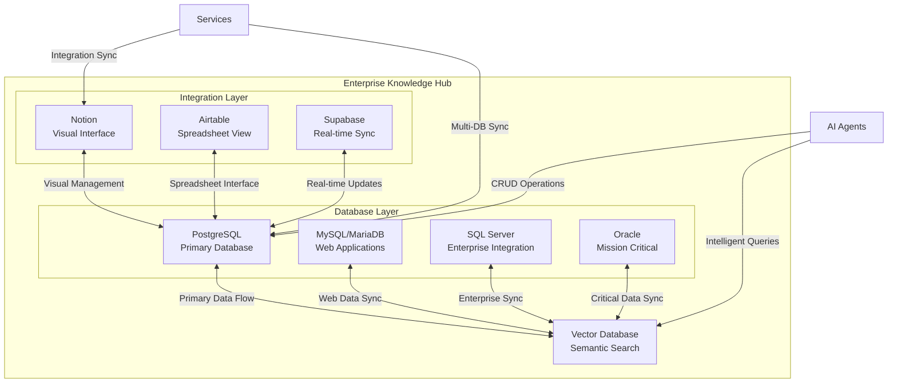
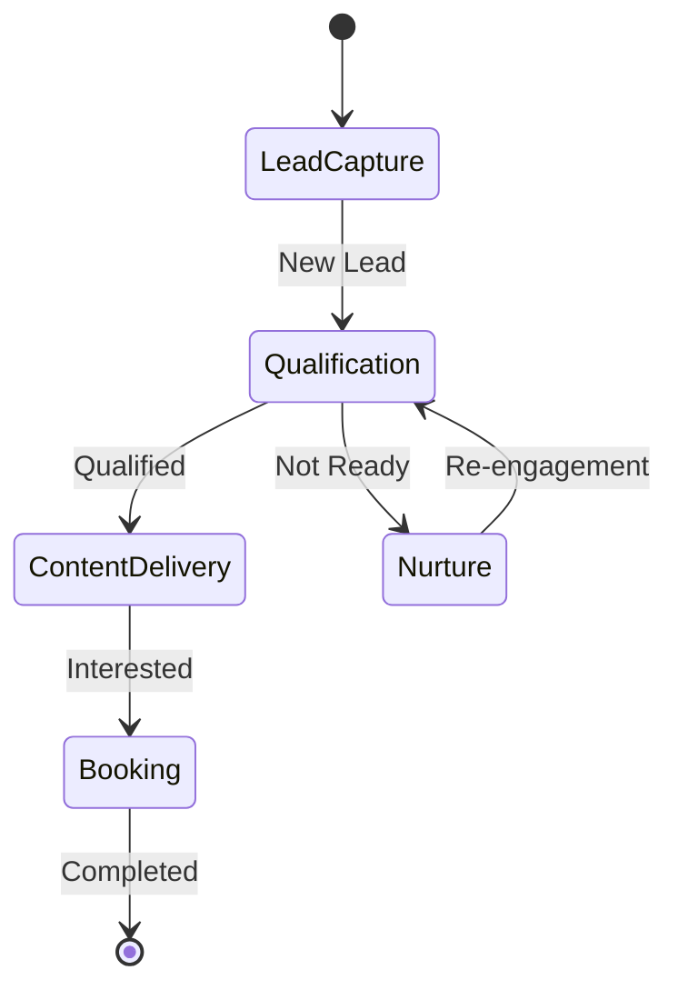
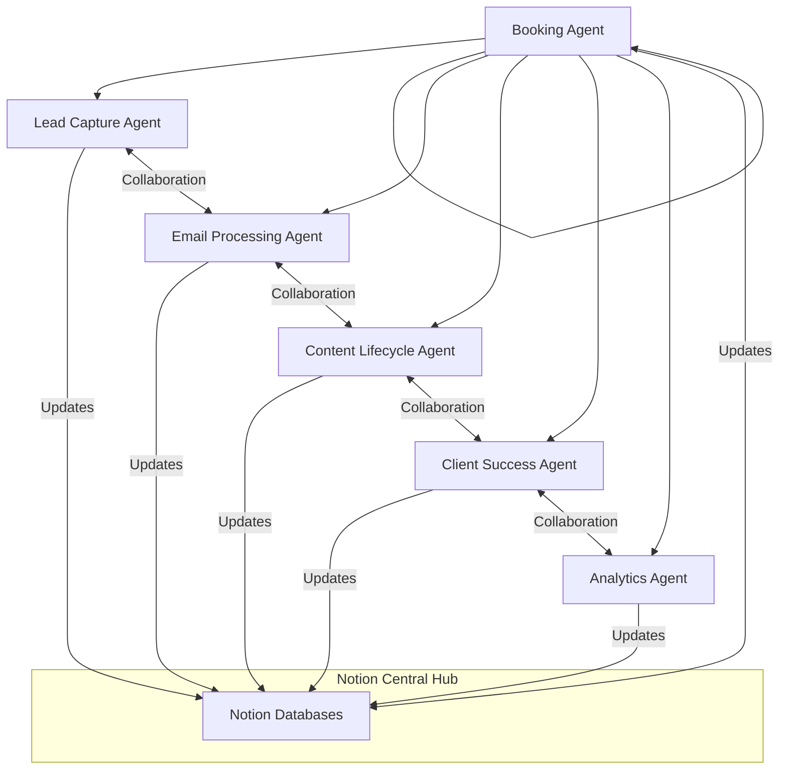

# Enhanced Architecture for The HigherSelf Network Server

This document outlines the implementation of the Comprehensive Automation Strategy for The HigherSelf Network Server, a proprietary automation platform designed to support ethical business practices and professional excellence across all industries while enhancing the system with advanced agent capabilities and knowledge management.

## Core Architectural Pillars

### Pillar 1: Enterprise Knowledge Hub (Multi-Database + Vector DB)

#### Current Implementation
- **Enterprise Database Layer**: Multi-database support including PostgreSQL, MySQL, MariaDB, SQL Server, Oracle
- **Integration Manager**: Coordinates data flow between services and enterprise database systems
- **Notion Integration**: Visual data management interface as one component among many

#### Enhancements
- **Vector Database Integration**:
  - Add support for storing embeddings of unstructured data (transcriptions, email content, website content)
  - Enable semantic search capabilities for AI agents across all data sources
  - Maintain bidirectional references between enterprise database records and vector store entries
- **Multi-Database Orchestration**:
  - Intelligent data routing based on data type and performance requirements
  - Cross-database transaction management with ACID compliance
  - Automated failover and disaster recovery across database systems



### Pillar 2: Advanced Agentic Workflow Engine

#### Current Implementation
- **Base Agent**: Abstract class with common agent functionality
- **Lead Capture Agent**: Handles lead processing workflow
- **Booking Agent**: Manages appointment scheduling workflow

#### Enhancements
- **Workflow State Machine**:
  - Implement a LangGraph-inspired state machine for complex workflow orchestration
  - Enable dynamic routing of tasks between agents
  - Improve error handling and retry mechanisms
  - Add visualization of workflow progress in Notion



### Pillar 3: Modular & Specialized AI Agent Design

#### Current Implementation
- **Base Agent**: Abstract class with registration in Notion
- **Specialized Agents**: LeadCaptureAgent, BookingAgent

#### Enhancements
- **Expanded Agent Library**:
  - EmailProcessingAgent: Handles email communication workflows
  - ContentLifecycleAgent: Manages content creation and distribution
  - ClientSuccessAgent: Monitors client progress and satisfaction
  - AnalyticsAgent: Generates insights and recommendations

- **Agent Collaboration Framework**:
  - Implement agent-to-agent communication protocols
  - Design skill libraries that can be shared across agents
  - Create agent coordination patterns for complex tasks



## Implementation Roadmap

### Phase 1: Knowledge Hub Enhancement
1. Integrate vector database (Supabase or Pinecone)
2. Develop embedding generation for unstructured data
3. Create bidirectional references between Notion and vector store
4. Implement semantic search capabilities

### Phase 2: Workflow Engine Development
1. Design state machine framework for workflows
2. Create workflow definition schema in Notion
3. Implement dynamic routing between agents
4. Develop visualization components for workflow status

### Phase 3: Specialized Agent Expansion
1. Implement EmailProcessingAgent
2. Develop ContentLifecycleAgent
3. Create ClientSuccessAgent
4. Build AnalyticsAgent
5. Design agent collaboration protocols

### Phase 4: Integration and Testing
1. Connect all components ensuring seamless data flow across the proprietary architecture
2. Implement comprehensive logging and monitoring with ethical data handling
3. Conduct performance and reliability testing with focus on user experience
4. Deploy with canary testing approach prioritizing system integrity

## Code Architecture

All enhancements will be implemented while maintaining the core principles of the HigherSelf Network's proprietary automation architecture. The following directory structure will be used:

```
.
├── agents/                     # Enhanced agent implementations
│   ├── base_agent.py           # Base agent with improved capabilities
│   ├── content_agent.py        # New content lifecycle agent
│   ├── email_agent.py          # New email processing agent
│   ├── lead_capture_agent.py   # Existing lead capture agent
│   └── booking_agent.py        # Existing booking agent
├── workflow/                   # New workflow engine
│   ├── state_machine.py        # LangGraph-inspired state machine
│   ├── transitions.py          # Workflow transition definitions
│   └── visualizer.py           # Workflow visualization tools
├── knowledge/                  # New knowledge hub components
│   ├── vector_store.py         # Vector database integration
│   ├── embeddings.py           # Embedding generation utilities
│   └── semantic_search.py      # Semantic search capabilities
├── services/                   # Existing service integrations
│   ├── notion_service.py       # Enhanced with vector store references
│   └── integration_manager.py  # Updated for advanced orchestration
└── models/                     # Data models
    ├── workflow_models.py      # Enhanced workflow state models
    └── knowledge_models.py     # New knowledge representation models
```

All components will be designed to prioritize:
1. Ethical data handling and transparency as core principles
2. Modularity and extensibility supporting diverse business needs
3. Intelligent automation capabilities with human-centered values
4. User-centric automation workflows promoting professional excellence

## Conclusion

This architecture integrates the principles from the Comprehensive Automation Strategy while preserving the existing foundation of The HigherSelf Network Server. The proprietary system maintains sophisticated data management and workflow orchestration, with enhanced capabilities for knowledge management, intelligent workflow automation, and specialized agent collaboration that supports the HigherSelf Network's commitment to ethical business practices and positive impact across all industries.
