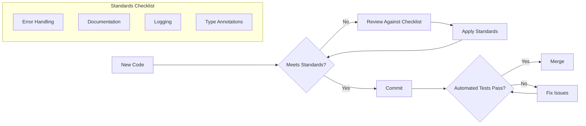

# Automation Infrastructure Improvements Documentation Plan

This document outlines the plan for creating the comprehensive `automation_infrastructure_improvements.md` documentation as requested.

## 1. Document Structure

The document will be structured into these main sections:

1. **Introduction**
   - Brief overview of the documentation purpose
   - Summary of the comprehensive improvements made
   - Highlight that TypeScript fixes and Google-style docstrings were the most significant improvements

2. **Major Improvements (Key Focus)**
   - **TypeScript Fixes in the7space Integration** (Expanded section)
     - Interface definitions with detailed examples
     - Strong typing implementation
     - Environment variable validation
     - Consistent API client patterns
   - **Google-style Docstring Implementation** (Expanded section)
     - Format overview with examples
     - Module, class, and function level documentation
     - Parameter and return value documentation
     - Type annotation integration

3. **Additional Code Improvements**
   - Python Code Consistency Improvements
   - Error Handling and Logging Standardization
   - Centralized Logging Utility Implementation

4. **New Standards Documentation**
   - Error Handling Patterns
   - Import Organization Patterns
   - Logging Approach

5. **Recommendations for Future Maintenance**
   - Tools for Automated Code Quality
   - Code Review Process
   - Strategy for Extending Improvements
   - Best Practices for Future Development

6. **Developer Checklist**
   - Pre-commit Verification List
   - Standards Adherence Guide
   - Reference to Python PEP Standards

## 2. Mermaid Diagram: Code Improvements Overview

```mermaid
graph TD
    A[Code Improvements] --> B[TypeScript Enhancements]
    A --> C[Google-style Docstrings]
    A --> D[Error Handling]
    A --> E[Other Python Improvements]
    A --> F[Logging Utility]
    
    %% TypeScript Enhancements (highlighted)
    subgraph "Key Focus Area"
    B --> B1[Interface Definitions]
    B --> B2[Strong Typing]
    B --> B3[Error Handling]
    B --> B4[ENV Validation]
    
    %% Google-style Docstrings (highlighted)
    C --> C1[Module Documentation]
    C --> C2[Class Documentation]
    C --> C3[Method Documentation]
    C --> C4[Type Annotations]
    end
    
    D --> D1[API Decorators]
    D --> D2[Retry Mechanism]
    D --> D3[Consistent Logging]
    D --> D4[Testing Support]
    
    E --> E1[Class Organization]
    E --> E2[Pydantic Models]
    E --> E3[Consistent Naming]
    E --> E4[Exception Handling]
    
    F --> F1[Loguru Integration]
    F --> F2[Standard Logging Fallback]
    F --> F3[Context Binding]
    F --> F4[Consistent API]
```

## 3. Mermaid Diagram: Standards Enforcement Process

## 4. Detailed TypeScript Improvement Documentation

The expanded section on TypeScript improvements will include:

1. **Interface Definitions**
   - Examples from `the7space-integration/src/index.ts` showing interfaces like `WPPost`, `AmeliaService`
   - Before/after comparison if possible
   - Best practices implemented

2. **Strong Typing Implementation**
   - Examples of strong typing in function parameters and return values
   - Use of TypeScript generics and utility types
   - Type safety improvements

3. **Environment Variable Validation**
   - Example of environment variable validation logic
   - Required vs. optional environment variables handling
   - Error messages and fallbacks

4. **API Client Patterns**
   - Examples of consistent API client setup
   - Error handling in API clients
   - Configuration patterns

## 5. Detailed Google-style Docstrings Documentation

This expanded section will include:

1. **Format Overview**
   - Components of Google-style docstrings (description, Args, Returns, Raises)
   - Proper indentation and formatting
   - Examples from different file types

2. **Module-level Documentation**
   - Examples from various Python modules
   - Best practices for module-level documentation

3. **Class Documentation**
   - Examples of class-level documentation
   - Attribute documentation

4. **Method Documentation**
   - Parameter documentation with types
   - Return value documentation
   - Exception documentation

5. **Type Annotation Integration**
   - How type annotations work with Google-style docstrings
   - Examples from the codebase

## 6. Implementation Plan

1. Create `automation_infrastructure_improvements.md` file
2. Implement the document structure as outlined above
3. Fill in each section with detailed content from our analysis
4. Include code examples for each standard with emphasis on TypeScript and Google-style docstrings
5. Add the Mermaid diagrams for visual clarity
6. Create the developer checklist with specific items

The implementation will be done in Code mode to create the full documentation with all the necessary details and examples from the codebase.
