# HigherSelf Network Server: Automation Infrastructure Completion Plan

## Overview

This plan outlines the implementation of the remaining components from the architecture document to complete the automation infrastructure for The HigherSelf Network Server. The implementation will focus on two main pillars:

1. **Knowledge Hub Enhancement** - Adding vector database capabilities to Supabase for semantic search and embedding storage
2. **Agent Collaboration Framework** - Enabling sophisticated agent-to-agent communication and shared skill libraries

## Implementation Phases

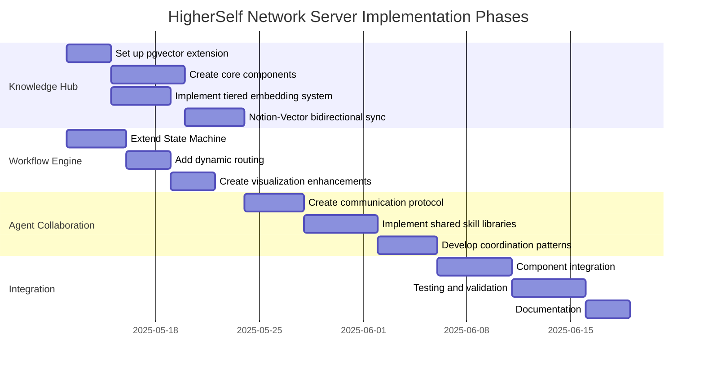

### Phase 1: Knowledge Hub Enhancement

This phase integrates vector database capabilities into the existing Supabase infrastructure with a resilient, tiered approach to embedding generation.

#### Step 1: Set up pgvector extension in Supabase

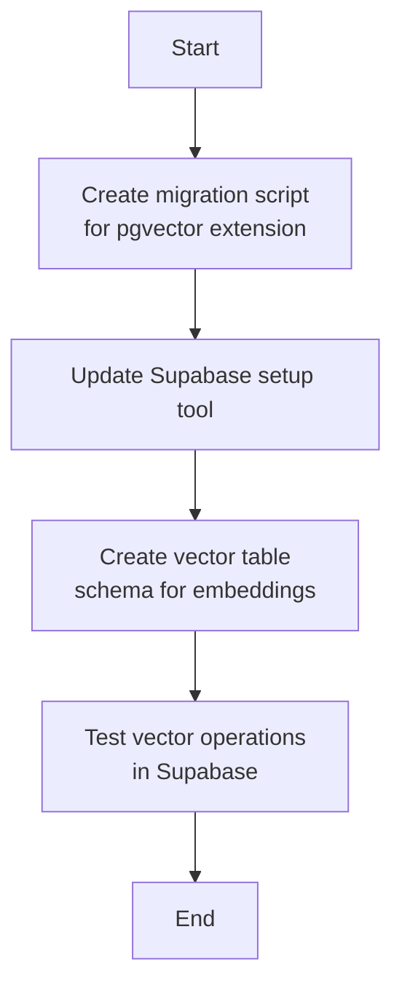

**Implementation Details:**
1. Create a new migration script `db/migrations/03_enable_vector_extension.sql`:
   ```sql
   -- Enable pgvector extension
   CREATE EXTENSION IF NOT EXISTS vector;

   -- Create embeddings table
   CREATE TABLE IF NOT EXISTS embeddings (
       id UUID PRIMARY KEY DEFAULT uuid_generate_v4(),
       notion_page_id TEXT,
       notion_database_id TEXT,
       content_type TEXT NOT NULL,
       content_hash TEXT NOT NULL,
       embedding_vector VECTOR(1536),
       metadata JSONB,
       created_at TIMESTAMP WITH TIME ZONE DEFAULT NOW(),
       updated_at TIMESTAMP WITH TIME ZONE DEFAULT NOW(),
       embedding_provider TEXT NOT NULL,
       UNIQUE(content_hash, embedding_provider)
   );

   -- Create vector chunks table for text splitting
   CREATE TABLE IF NOT EXISTS vector_chunks (
       id UUID PRIMARY KEY DEFAULT uuid_generate_v4(),
       embedding_id UUID REFERENCES embeddings(id) ON DELETE CASCADE,
       chunk_index INTEGER NOT NULL,
       chunk_text TEXT NOT NULL,
       chunk_embedding VECTOR(1536),
       metadata JSONB,
       created_at TIMESTAMP WITH TIME ZONE DEFAULT NOW(),
       UNIQUE(embedding_id, chunk_index)
   );

   -- Create indexes for similarity search
   CREATE INDEX ON embeddings USING ivfflat (embedding_vector vector_cosine_ops) WITH (lists = 100);
   CREATE INDEX ON vector_chunks USING ivfflat (chunk_embedding vector_cosine_ops) WITH (lists = 100);
   ```

2. Update `tools/supabase_db_setup.py` to ensure the pgvector extension is properly initialized

#### Step 2: Create the Knowledge Hub core components with tiered fallback system

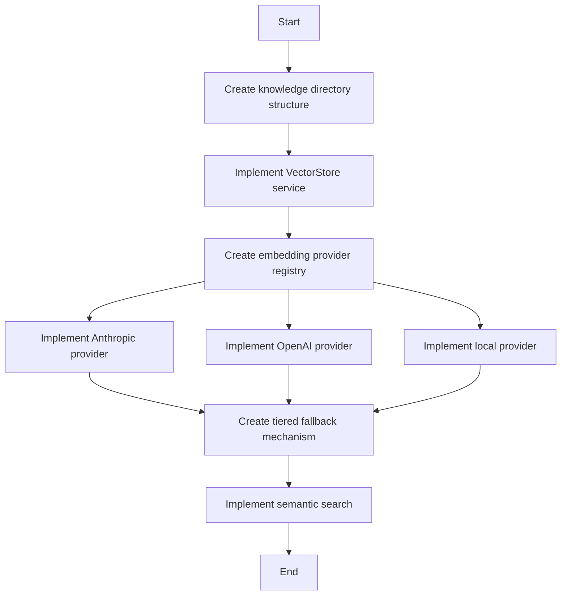

**Implementation Details:**
1. Create a new `knowledge` directory structure:
   ```
   knowledge/
   ├── __init__.py
   ├── vector_store.py
   ├── embeddings.py
   ├── providers/
   │   ├── __init__.py
   │   ├── base_provider.py
   │   ├── anthropic_provider.py
   │   ├── openai_provider.py
   │   ├── local_provider.py
   │   └── registry.py
   ├── semantic_search.py
   └── models.py
   ```

2. Implement `knowledge/models.py` with Pydantic models for knowledge hub data:
   ```python
   from pydantic import BaseModel, Field
   from typing import Dict, Any, List, Optional, Union
   from datetime import datetime
   from uuid import UUID
   
   class EmbeddingMeta(BaseModel):
       """Metadata for an embedding."""
       content_type: str
       source: str
       notion_reference: Optional[str] = None
       tags: List[str] = Field(default_factory=list)
       additional_meta: Dict[str, Any] = Field(default_factory=dict)
   
   class VectorRecord(BaseModel):
       """A record in the vector store."""
       id: UUID
       notion_page_id: Optional[str] = None
       notion_database_id: Optional[str] = None
       content_type: str
       content_hash: str
       embedding_vector: List[float]
       metadata: EmbeddingMeta
       created_at: datetime
       updated_at: datetime
       embedding_provider: str
   
   class ChunkRecord(BaseModel):
       """A text chunk with its embedding."""
       id: UUID
       embedding_id: UUID
       chunk_index: int
       chunk_text: str
       chunk_embedding: List[float]
       metadata: Dict[str, Any]
       created_at: datetime
   
   class SearchResult(BaseModel):
       """A search result from the vector store."""
       record: Union[VectorRecord, ChunkRecord]
       score: float
       distance: float
   ```

3. Implement `knowledge/providers/base_provider.py` as the base class for embedding providers:
   ```python
   from abc import ABC, abstractmethod
   from typing import List, Dict, Any, Optional
   import numpy as np
   
   class BaseEmbeddingProvider(ABC):
       """Base class for embedding providers."""
       
       @property
       @abstractmethod
       def provider_name(self) -> str:
           """Get the name of this provider."""
           pass
       
       @property
       @abstractmethod
       def embedding_dimensions(self) -> int:
           """Get the dimensions of embeddings from this provider."""
           pass
       
       @abstractmethod
       async def get_embeddings(self, texts: List[str]) -> List[List[float]]:
           """
           Get embeddings for a list of texts.
           
           Args:
               texts: List of text strings to embed
               
           Returns:
               List of embedding vectors
           """
           pass
       
       @abstractmethod
       async def health_check(self) -> Dict[str, Any]:
           """
           Check the health of this provider.
           
           Returns:
               Health check results
           """
           pass
   ```

4. Implement the tiered providers with graceful fallback in `knowledge/providers/registry.py`:
   ```python
   from typing import List, Dict, Any, Optional, Type
   from .base_provider import BaseEmbeddingProvider
   from .anthropic_provider import AnthropicEmbeddingProvider
   from .openai_provider import OpenAIEmbeddingProvider
   from .local_provider import LocalEmbeddingProvider
   from loguru import logger
   import asyncio
   from enum import Enum
   
   class ProviderPriority(Enum):
       """Priority levels for embedding providers."""
       PRIMARY = 1
       SECONDARY = 2
       FALLBACK = 3
   
   class EmbeddingProviderRegistry:
       """Registry for embedding providers with fallback capability."""
       
       def __init__(self):
           """Initialize the registry."""
           self.providers: Dict[ProviderPriority, BaseEmbeddingProvider] = {}
           self.initialized = False
           
       async def initialize(self):
           """Initialize all providers."""
           if self.initialized:
               return
               
           # Set up providers with priority
           try:
               # Primary provider (Anthropic)
               anthropic_provider = AnthropicEmbeddingProvider()
               self.providers[ProviderPriority.PRIMARY] = anthropic_provider
               logger.info(f"Initialized primary embedding provider: {anthropic_provider.provider_name}")
               
               # Secondary provider (OpenAI)
               openai_provider = OpenAIEmbeddingProvider()
               self.providers[ProviderPriority.SECONDARY] = openai_provider
               logger.info(f"Initialized secondary embedding provider: {openai_provider.provider_name}")
               
               # Fallback provider (Local)
               local_provider = LocalEmbeddingProvider()
               self.providers[ProviderPriority.FALLBACK] = local_provider
               logger.info(f"Initialized fallback embedding provider: {local_provider.provider_name}")
               
               self.initialized = True
           except Exception as e:
               logger.error(f"Error initializing embedding providers: {e}")
               raise
       
       async def get_embeddings(self, texts: List[str]) -> Dict[str, Any]:
           """
           Get embeddings with fallback capability.
           
           Args:
               texts: List of text strings to embed
               
           Returns:
               Dict with provider name, embeddings, and success status
           """
           if not self.initialized:
               await self.initialize()
               
           # Try providers in priority order
           for priority in sorted(ProviderPriority, key=lambda p: p.value):
               provider = self.providers.get(priority)
               if not provider:
                   continue
                   
               try:
                   # Check provider health first
                   health = await provider.health_check()
                   if not health.get("healthy", False):
                       logger.warning(f"Provider {provider.provider_name} is not healthy, trying next")
                       continue
                       
                   # Get embeddings from this provider
                   embeddings = await provider.get_embeddings(texts)
                   
                   return {
                       "provider": provider.provider_name,
                       "embeddings": embeddings,
                       "success": True
                   }
               except Exception as e:
                   logger.error(f"Error getting embeddings from {provider.provider_name}: {e}")
                   # Continue to next provider
           
           # All providers failed
           logger.error("All embedding providers failed")
           return {
               "provider": None,
               "embeddings": None,
               "success": False
           }
   
   # Singleton instance
   provider_registry = EmbeddingProviderRegistry()
   ```

5. Implement the specific providers:
   - `anthropic_provider.py` - Using Anthropic's API for embeddings
   - `openai_provider.py` - Using OpenAI's embedding models
   - `local_provider.py` - Using sentence-transformers for local embeddings

6. Implement `knowledge/vector_store.py` to provide CRUD operations for vector data.

7. Implement `knowledge/semantic_search.py` for vector search capabilities.

#### Step 3: Create Notion-Vector store bidirectional sync

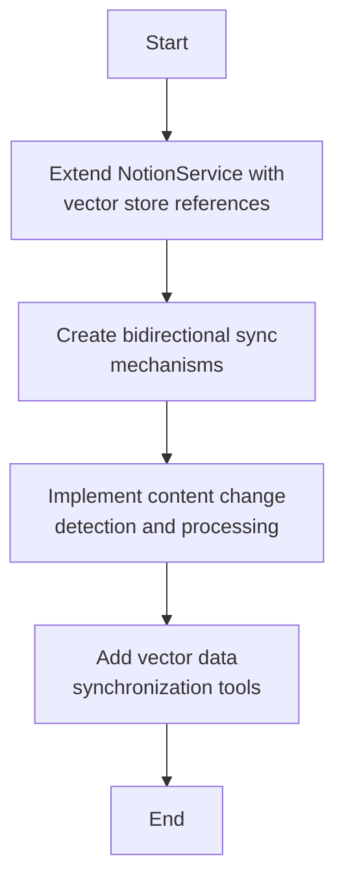

**Implementation Details:**
1. Extend `services/notion_service.py` to include methods for working with the vector store
2. Create a new `services/knowledge_service.py` to coordinate between Notion and the vector store
3. Implement `tools/sync_notion_to_vector.py` for batch synchronization

### Phase 2: Workflow Engine Enhancement

This phase expands the existing workflow engine to support more sophisticated orchestration patterns.

#### Step 1: Extend State Machine with dynamic routing

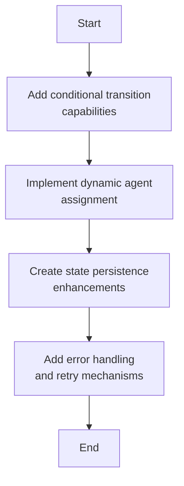

**Implementation Details:**
1. Enhance `workflow/state_machine.py` with:
   - Support for conditional transitions based on context data
   - Dynamic routing of tasks to appropriate agents
   - Enhanced error handling with retry logic
   - Timeout management for long-running operations

2. Update `workflow/transitions.py` to include:
   - More sophisticated transition conditions
   - Transition handlers for complex state changes
   - Event-based transition triggers

#### Step 2: Create workflow visualization enhancements

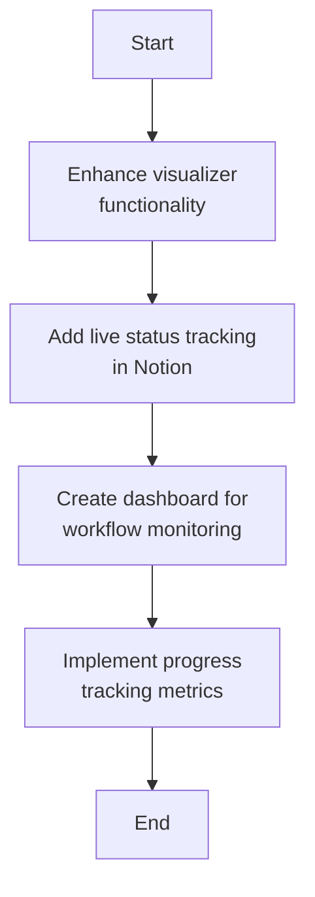

**Implementation Details:**
1. Enhance `workflow/visualizer.py` to provide:
   - Enhanced Mermaid diagrams with more visualization options
   - Progress tracking visualization
   - Historical workflow path visualization

2. Add Notion-based visualization:
   - Update workflow instances with visual status information
   - Create rich visual representations in Notion pages

### Phase 3: Agent Collaboration Framework

This phase implements mechanisms for agents to collaborate effectively on complex tasks.

#### Step 1: Create agent communication protocol

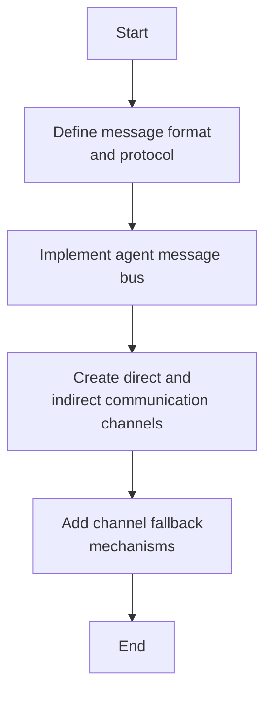

**Implementation Details:**
1. Enhance `utils/message_bus.py` to implement a robust message bus for inter-agent communication:
   - Standardized message format for agent communication
   - Support for synchronous and asynchronous communication patterns
   - Message routing and delivery guarantees with retry mechanisms
   - Multiple communication channels with automatic fallback

2. Update `agents/base_agent.py` to include communication capabilities:
   - Methods for sending and receiving messages
   - Message handling callbacks
   - Support for different message types (requests, responses, broadcasts)

#### Step 2: Create shared skill libraries

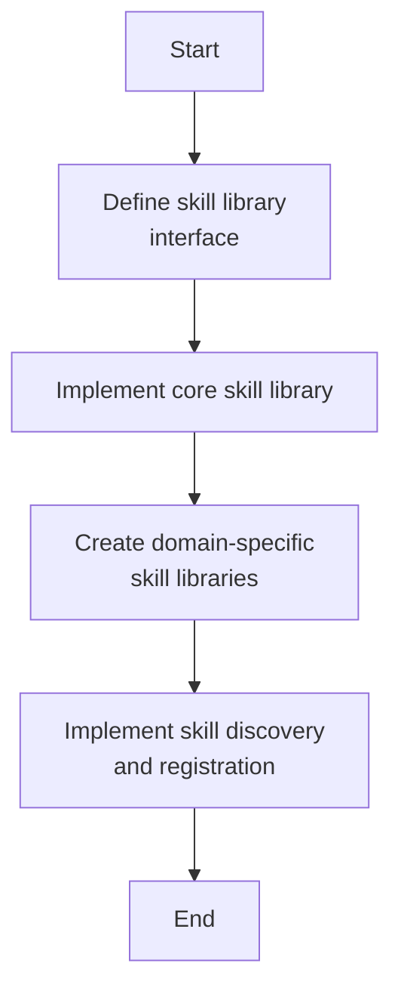

**Implementation Details:**
1. Create a new `agents/skills` directory:
   ```
   agents/skills/
   ├── __init__.py
   ├── base.py
   ├── communication_skills.py
   ├── data_processing_skills.py
   ├── notion_skills.py
   └── specialized_skills.py
   ```

2. Implement `skills/base.py` to define the skill interface and registration mechanisms

3. Implement shared skill libraries:
   - `communication_skills.py` - Email composition, message formatting
   - `data_processing_skills.py` - Data transformation, validation
   - `notion_skills.py` - Notion-specific operations
   - `specialized_skills.py` - Domain-specific operations

4. Update agents to leverage shared skills:
   - Add skill discovery and loading mechanisms
   - Implement skill invocation patterns
   - Add skill caching for performance

#### Step 3: Implement agent coordination patterns

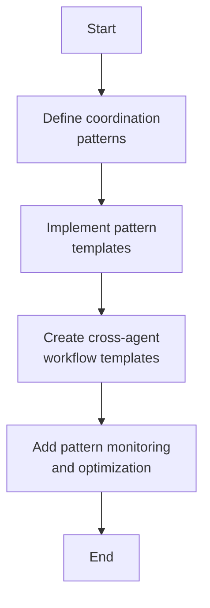

**Implementation Details:**
1. Create `agents/coordination` directory for coordination patterns:
   ```
   agents/coordination/
   ├── __init__.py
   ├── patterns.py
   ├── workflows.py
   └── templates.py
   ```

2. Implement common coordination patterns:
   - Request-response
   - Publish-subscribe
   - Delegated tasks
   - Concurrent processing
   - Sequential chains

3. Create templates for complex multi-agent workflows:
   - Lead nurturing sequence
   - Content creation and distribution
   - Event coordination
   - Customer support

### Phase 4: Integration and Testing

This phase ensures all components work together seamlessly and are thoroughly tested.

#### Step 1: Integration of all components

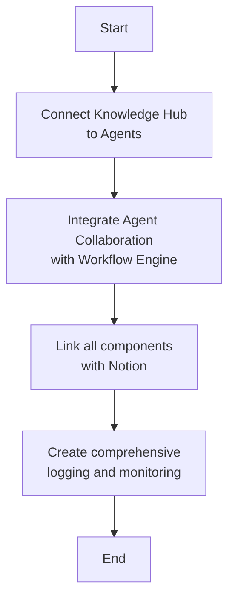

**Implementation Details:**
1. Update agent implementations to use the Knowledge Hub for:
   - Accessing relevant information
   - Storing generated content with embeddings
   - Leveraging semantic search for decision making

2. Connect the Agent Collaboration Framework with the Workflow Engine:
   - Use state transitions to trigger agent collaborations
   - Update workflow state based on agent coordination outcomes

3. Enhance logging and monitoring:
   - Create `utils/monitoring.py` for comprehensive system monitoring
   - Implement structured logging across all components
   - Add performance metrics collection

#### Step 2: Comprehensive testing

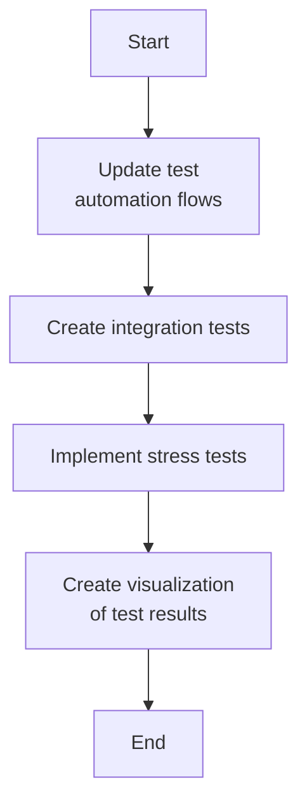

**Implementation Details:**
1. Update `tools/test_automation_flows.py` to include the new capabilities:
   - Knowledge Hub operations
   - Agent collaboration scenarios
   - Complex workflow patterns

2. Create integration tests for all connected components

3. Implement stress tests for:
   - Concurrent agent operations
   - Large-scale embedding generation
   - High-volume workflow transitions

## Repository Structure Additions

The implementation will add the following directories and files to your repository:

```
.
├── knowledge/                   # New Knowledge Hub components
│   ├── __init__.py
│   ├── vector_store.py
│   ├── embeddings.py
│   ├── providers/              # Embedding providers
│   │   ├── __init__.py
│   │   ├── base_provider.py
│   │   ├── anthropic_provider.py
│   │   ├── openai_provider.py
│   │   ├── local_provider.py
│   │   └── registry.py
│   ├── semantic_search.py
│   └── models.py
├── agents/
│   ├── ...                     # Existing agent files
│   ├── skills/                 # New shared skills directory
│   │   ├── __init__.py
│   │   ├── base.py
│   │   └── ...                 # Skill library files
│   └── coordination/           # New coordination patterns
│       ├── __init__.py
│       ├── patterns.py
│       └── ...                 # Coordination implementation files
├── db/migrations/
│   ├── ...                     # Existing migration files
│   └── 03_enable_vector_extension.sql  # New migration for pgvector
├── services/
│   ├── ...                     # Existing service files
│   └── knowledge_service.py    # New service for Knowledge Hub
└── tools/
    ├── ...                     # Existing tool files
    ├── sync_notion_to_vector.py  # New synchronization tool
    └── manage_vector_store.py    # New vector store management tool
```

## Required Dependencies

Add the following dependencies to `requirements.txt`:

```
# Vector database support
pgvector==0.1.8
sentence-transformers==2.2.2
langchain==0.0.267
lakera-guard==0.0.3  # optional for security
pinecone-client==2.2.2  # optional alternative vector DB

# Testing and monitoring
pytest-benchmark==4.0.0
prometheus-client==0.17.1
```

## Migration and Deployment

For smooth migration and deployment, we'll adopt a phased rollout approach:

1. Update environment variables and configuration
2. Create database migration scripts
3. Update Docker compose files
4. Implement canary deployment
5. Create rollback plan

## Documentation Updates

To ensure the implementation is well-documented:

1. Update architecture documentation
2. Create detailed component reference documentation
3. Update developer implementation guide
4. Create API reference for new capabilities