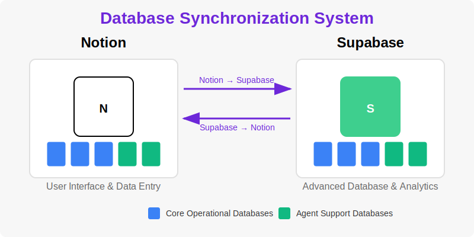

# The HigherSelf Network Database Synchronization System
# Implementation Guide

## Introduction

This guide provides comprehensive instructions for implementing and using the database synchronization system for The HigherSelf Network Server. This system aligns and synchronizes the 16 Notion databases with corresponding Supabase tables, providing enhanced capabilities while maintaining the user-friendly Notion interface.

## Table of Contents

1. [System Overview](#system-overview)
2. [For Developers](#for-developers)
3. [For Staff](#for-staff)
4. [Implementation Timeline](#implementation-timeline)
5. [Support Resources](#support-resources)

## System Overview

The HigherSelf Network Server uses a dual-database approach:

1. **Notion Databases**: The primary user interface where staff interact with data
2. **Supabase**: A PostgreSQL database that provides advanced querying, analytics, and integration capabilities

These two systems are kept in sync automatically, allowing you to leverage the strengths of both platforms.



### The 16 Databases

Our system includes 16 interconnected databases:

#### Core Operational Databases

1. **Business Entities Registry** - Central registry of all business entities
2. **Contacts & Profiles** - Customer and contact information
3. **Community Hub** - Community member data
4. **Products & Services** - Product and service catalog
5. **Workflow Instances** - Active workflow instances
6. **Marketing Campaigns** - Marketing campaign data
7. **Feedback & Surveys** - Customer feedback and survey responses
8. **Rewards & Bounties** - Reward and bounty programs
9. **Master Tasks Database** - Centralized task management

#### Agent & System Support Databases

10. **Agent Communication Patterns** - Communication patterns between agents
11. **Agent Registry** - Registry of all agents in the system
12. **API Integrations Catalog** - Catalog of API integrations
13. **Data Transformations Registry** - Registry of data transformation rules
14. **Notifications Templates** - Templates for notifications
15. **Use Cases Library** - Library of use cases
16. **Workflows Library** - Library of workflow definitions

## For Developers

Developers should refer to the [Developer Implementation Guide](DEVELOPER_IMPLEMENTATION_GUIDE.md) for detailed technical instructions. Here's a summary of the key points:

### Setup Process

1. **Configure Environment Variables**:
   ```
   SUPABASE_URL=https://mmmtfmulvmvtxybwxxrr.supabase.co
   SUPABASE_API_KEY=your_supabase_api_key
   SUPABASE_PROJECT_ID=mmmtfmulvmvtxybwxxrr
   ```

2. **Create Supabase Tables**:
   ```bash
   python -m tools.supabase_db_setup
   ```

3. **Perform Initial Synchronization**:
   ```bash
   python -m tools.sync_databases --direction notion_to_supabase
   ```

### Key Components

- **Migration Scripts**: Define the Supabase database schema
- **Supabase Service**: Handles interactions with the Supabase API
- **Database Sync Service**: Coordinates synchronization between Notion and Supabase
- **Command-line Tools**: Provide interfaces for setup and synchronization

### Development Workflow

When making changes to the database structure:

1. Update the Pydantic models in `models/notion_db_models.py` or `models/notion_db_models_extended.py`
2. Create a migration script to update the Supabase tables
3. Run the migration script
4. Test the synchronization with the new structure

## For Staff

Staff members should refer to the [Staff Implementation Guide](STAFF_IMPLEMENTATION_GUIDE.md) for user-friendly instructions. Here's a summary of the key points:

### What Changes for You

**The good news**: Your daily workflow in Notion remains largely unchanged! You can continue to:

- Create and edit records in Notion as you always have
- Use the same Notion views and dashboards
- Follow the same processes for data entry and management

The synchronization with Supabase happens automatically in the background.

### Benefits You'll Notice

1. **Faster loading**: Some views and reports will load much faster
2. **New reports**: You'll have access to more advanced reports and analytics
3. **Additional fields**: Some databases may have new fields related to synchronization
4. **Fewer "Loading..." messages**: The system will be more responsive overall

### Best Practices

To get the most out of the dual-database system:

1. **Always use Notion for data entry**: Make all your changes in Notion, not directly in Supabase
2. **Be patient with sync**: Changes may take a minute to synchronize between systems
3. **Check the "Last Synced" field**: This shows when a record was last synchronized
4. **Report sync issues**: If you notice data discrepancies, report them to the tech team

## Implementation Timeline

Here's what to expect during the implementation process:

1. **Preparation Phase** (Current)
   - Technical setup and testing
   - Staff training and documentation

2. **Soft Launch** (Next Week)
   - System goes live with monitoring
   - Staff begins using the synchronized system
   - Extra support available for questions

3. **Full Implementation** (Two Weeks)
   - All features enabled
   - Advanced reporting available
   - Regular operation with standard support

4. **Optimization** (Ongoing)
   - Continuous improvements based on feedback
   - Additional features rolled out as developed

## Support Resources

### Documentation

- [Developer Implementation Guide](DEVELOPER_IMPLEMENTATION_GUIDE.md) - Technical details for developers
- [Staff Implementation Guide](STAFF_IMPLEMENTATION_GUIDE.md) - User-friendly guide for staff
- [Database Visualization](../assets/database_visualization.html) - Interactive visualization of the database structure

### Training

- **Video tutorials**: Available on the internal training portal
- **Live training sessions**: Scheduled for the first week of implementation
- **One-on-one support**: Available by appointment for the first month

### Getting Help

If you encounter any issues with the database system:

1. **Check the guides**: Review the relevant sections of the documentation
2. **Ask your team lead**: They may have encountered similar issues
3. **Contact technical support**: For unresolved issues, email support@thehigherself.network
4. **Join office hours**: Technical team holds office hours every Wednesday at 2pm

## Conclusion

This database synchronization system represents an important step forward for The HigherSelf Network, enabling us to serve our clients better while maintaining the ease of use of Notion. By combining the user-friendly interface of Notion with the powerful database capabilities of Supabase, we've created a system that offers the best of both worlds.

For a visual representation of the database structure, open the [Database Visualization](../assets/database_visualization.html) in your web browser.
