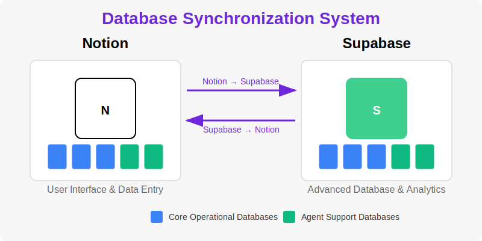

# Staff Implementation Guide: Database System

## Introduction

Welcome to The HigherSelf Network's database system guide! This document explains how our database system works in simple terms and provides instructions for using it effectively in your daily operations. Our system connects Notion (which you're already familiar with) with a powerful database called Supabase to give you the best of both worlds.

## What You Need to Know

### The Big Picture

Our system uses **two connected databases** that work together:

1. **Notion Databases**: These are the 16 databases you already use in Notion for your daily work
2. **Supabase**: A powerful behind-the-scenes database that helps with advanced features

These two systems stay synchronized automatically, so you can continue working in Notion as usual while benefiting from enhanced capabilities.

### Why We Use This System

This dual-database approach provides several benefits:

- **Keep using Notion**: Continue working in the familiar Notion interface
- **Faster performance**: Some operations will be much faster
- **Better reporting**: More powerful analytics and reporting capabilities
- **Enhanced security**: Additional data protection and backup
- **Advanced features**: Enables new features that weren't possible before

## The 16 Databases

Our system includes 16 interconnected databases that work together. Here's a simple explanation of each:

### Core Operational Databases

1. **Business Entities Registry**: Information about our businesses (The Connection Practice, The 7 Space)
2. **Contacts & Profiles**: All client and contact information
3. **Community Hub**: Community member details and engagement
4. **Products & Services**: Our offerings catalog
5. **Workflow Instances**: Active processes being tracked
6. **Marketing Campaigns**: Marketing initiatives and their performance
7. **Feedback & Surveys**: Client feedback and survey responses
8. **Rewards & Bounties**: Reward programs and incentives
9. **Master Tasks**: Central task management

### Agent & System Support Databases

10. **Agent Communication Patterns**: How our digital assistants talk to each other
11. **Agent Registry**: Directory of our digital assistants
12. **API Integrations Catalog**: Connections to other software systems
13. **Data Transformations Registry**: Rules for converting data between systems
14. **Notifications Templates**: Templates for automated messages
15. **Use Cases Library**: Documentation of business scenarios
16. **Workflows Library**: Definitions of standard processes

## How to Use the System

### Your Daily Workflow

**The good news**: Your daily workflow in Notion remains largely unchanged! You can continue to:

- Create and edit records in Notion as you always have
- Use the same Notion views and dashboards
- Follow the same processes for data entry and management

The synchronization with Supabase happens automatically in the background.

### Best Practices

To get the most out of our dual-database system:

1. **Always use Notion for data entry**: Make all your changes in Notion, not directly in Supabase
2. **Be patient with sync**: Changes may take a minute to synchronize between systems
3. **Check the "Last Synced" field**: This shows when a record was last synchronized
4. **Report sync issues**: If you notice data discrepancies, report them to the tech team

### What's Different Now

You'll notice a few enhancements to your Notion experience:

1. **Faster loading**: Some views and reports will load much faster
2. **New reports**: You'll have access to more advanced reports and analytics
3. **Additional fields**: Some databases may have new fields related to synchronization
4. **Fewer "Loading..." messages**: The system will be more responsive overall

## Common Scenarios

### Scenario 1: Adding a New Client

1. Add the client to the Contacts & Profiles database in Notion as usual
2. The system will automatically synchronize this data to Supabase
3. You'll see the "Last Synced" field update once synchronization is complete
4. Any automated workflows will now have access to this client data

### Scenario 2: Updating a Product

1. Find the product in the Products & Services database in Notion
2. Make your changes as you normally would
3. Save the changes
4. The system will automatically update Supabase with these changes
5. Any systems connected to our database (like the website) will reflect these updates

### Scenario 3: Running Reports

1. For standard reports, continue using Notion views as usual
2. For advanced analytics, you'll now have access to new reports in the "Analytics" section
3. These new reports are powered by Supabase and offer more detailed insights
4. You can export these reports to Excel or PDF as needed

## Frequently Asked Questions

### General Questions

**Q: Do I need to learn how to use Supabase?**
A: No! You can continue working in Notion as usual. Supabase works behind the scenes.

**Q: Will I lose any data during synchronization?**
A: No. The system is designed to preserve all data and has multiple safeguards in place.

**Q: How often does synchronization happen?**
A: Synchronization happens automatically every few minutes. Most changes sync within 5 minutes.

**Q: What happens if I make a mistake in Notion?**
A: Just correct it in Notion as you normally would. The correction will be synchronized to Supabase.

### Technical Questions

**Q: What if the internet connection is lost during synchronization?**
A: The system will automatically retry when the connection is restored. No data will be lost.

**Q: Can I access Supabase directly?**
A: Only the technical team has direct access to Supabase. All staff should work through Notion.

**Q: What happens if I delete a record in Notion?**
A: The record will be marked as deleted in Supabase but will be preserved for historical purposes.

**Q: Will this affect my Notion notifications?**
A: No, all Notion notifications will continue to work as before.

## Getting Help

If you encounter any issues with the database system:

1. **Check this guide**: Review the relevant sections of this document
2. **Ask your team lead**: They may have encountered similar issues
3. **Contact technical support**: For unresolved issues, email support@thehigherself.network
4. **Join office hours**: Technical team holds office hours every Wednesday at 2pm

## Training Resources

We've prepared several resources to help you get comfortable with the new system:

1. **Video tutorials**: Available on the internal training portal
2. **Quick reference guide**: Printable PDF with common tasks and tips
3. **Live training sessions**: Scheduled for the first week of implementation
4. **One-on-one support**: Available by appointment for the first month

## Implementation Timeline

Here's what to expect during the implementation process:

1. **Preparation Phase** (Current)
   - Technical setup and testing
   - Staff training and documentation

2. **Soft Launch** (Next Week)
   - System goes live with monitoring
   - Staff begins using the synchronized system
   - Extra support available for questions

3. **Full Implementation** (Two Weeks)
   - All features enabled
   - Advanced reporting available
   - Regular operation with standard support

4. **Optimization** (Ongoing)
   - Continuous improvements based on feedback
   - Additional features rolled out as developed

## Conclusion

This new database system represents an important step forward for The HigherSelf Network, enabling us to serve our clients better while maintaining the ease of use you're accustomed to with Notion. Your feedback during this transition is invaluable, so please share your experiences and suggestions.

Remember: You can continue working in Notion just as you always have, while benefiting from the enhanced capabilities this new system provides behind the scenes.

Thank you for your participation in this exciting improvement to our operations!
