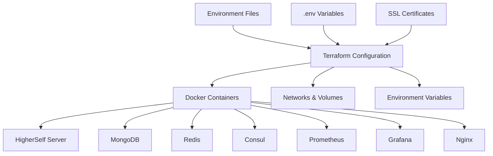

# HigherSelf Network Server - Terraform Integration Guide

## 🎯 Overview

This guide provides comprehensive instructions for integrating Terraform into the HigherSelf Network Server enterprise automation platform, enabling Infrastructure as Code (IaC) capabilities for scalable, repeatable deployments.

## 🏗️ Architecture Integration

### Current Stack Enhancement
Terraform enhances your existing Docker Compose setup by providing:

- **Environment Management**: Separate configurations for dev/staging/production
- **Resource Orchestration**: Automated container, network, and volume management  
- **State Management**: Centralized infrastructure state tracking
- **Scalability**: Auto-scaling and resource optimization
- **Security**: Enterprise-grade security configurations
- **Monitoring**: Integrated observability stack

### Integration Points



## 🚀 Quick Start

### Prerequisites Checklist

- [x] **Terraform Installed**: v1.6.6+ (✅ Completed)
- [ ] **Docker Desktop**: Start Docker Desktop application
- [ ] **Environment Variables**: Configure integration tokens
- [ ] **SSL Certificates**: For staging/production (optional for dev)

### Step 1: Start Docker Desktop

**macOS**: Open Docker Desktop from Applications or run:
```bash
open -a Docker
```

Wait for Docker to start (you'll see the Docker icon in your menu bar).

### Step 2: Initialize Development Environment

```bash
cd terraform
./init.sh development
```

### Step 3: Deploy Infrastructure

```bash
./deploy.sh development apply
```

## 🔧 Configuration Management

### Environment Structure

```
terraform/
├── environments/
│   ├── development.tfvars    # Local development
│   ├── staging.tfvars        # Pre-production testing
│   └── production.tfvars     # Live production
```

### Variable Hierarchy

1. **Default Values** (variables.tf)
2. **Environment Files** (*.tfvars)
3. **Environment Variables** (TF_VAR_*)
4. **Command Line** (-var flags)

### Security Configuration

**Development**: Permissive settings for local testing
**Staging**: Production-like security for validation
**Production**: Enterprise-grade security controls

## 🔐 Security Implementation

### Password Management

```bash
# Generate secure passwords
openssl rand -base64 32  # For database passwords
openssl rand -hex 16     # For API keys
```

### SSL Certificate Setup

**Development**: Self-signed certificates (optional)
```bash
mkdir -p deployment/ssl
openssl req -x509 -newkey rsa:4096 -keyout deployment/ssl/dev_key.pem -out deployment/ssl/dev_cert.pem -days 365 -nodes
```

**Production**: Use certificates from your CA
```bash
# Place your certificates in:
deployment/ssl/prod_cert.pem
deployment/ssl/prod_key.pem
```

### Network Security

- **Isolated Networks**: All services communicate through dedicated Docker networks
- **Port Restrictions**: Only necessary ports exposed externally
- **IP Whitelisting**: Configurable IP access controls
- **SSL/TLS**: End-to-end encryption for external communications

## 📊 Monitoring Integration

### Observability Stack

**Prometheus**: Metrics collection and alerting
- Endpoint: http://localhost:9090
- Scrapes metrics from all services
- Custom HigherSelf Network metrics

**Grafana**: Visualization and dashboards
- Endpoint: http://localhost:3000
- Default login: admin/admin
- Pre-configured dashboards for HigherSelf services

**Consul**: Service discovery and health checking
- Endpoint: http://localhost:8500
- Service registration and discovery
- Health check aggregation

### Custom Metrics

The HigherSelf Network Server exposes custom metrics:
- Agent performance metrics
- Notion integration statistics
- API request/response metrics
- Database operation metrics
- Cache hit/miss ratios

## 🔄 Deployment Workflows

### Development Workflow

```bash
# 1. Start development environment
./init.sh development
./deploy.sh development apply

# 2. Make changes to your application
# 3. Rebuild and redeploy
docker-compose build windsurf-agent
docker-compose up -d windsurf-agent

# 4. View logs
docker-compose logs -f windsurf-agent
```

### Staging Deployment

```bash
# 1. Deploy to staging
./deploy.sh staging apply

# 2. Run integration tests
curl http://localhost:8000/health
curl http://localhost:8000/docs

# 3. Validate monitoring
open http://localhost:9090  # Prometheus
open http://localhost:3000  # Grafana
```

### Production Deployment

```bash
# 1. Security checklist
# - Update all passwords
# - Configure SSL certificates
# - Set IP restrictions
# - Configure backup storage

# 2. Deploy with confirmation
./deploy.sh production apply

# 3. Post-deployment validation
# - Health checks
# - Monitoring alerts
# - Backup verification
# - Performance testing
```

## 🔧 Troubleshooting

### Common Issues

**Docker Not Running**
```bash
# Start Docker Desktop
open -a Docker
# Wait for Docker to start, then retry
```

**Port Conflicts**
```bash
# Check what's using ports
lsof -i :8000
lsof -i :27017
lsof -i :6379

# Stop conflicting services
docker-compose down
```

**Permission Issues**
```bash
# Fix Docker permissions
sudo chown -R $USER:$USER ~/.docker
```

**SSL Certificate Issues**
```bash
# Verify certificate files
ls -la deployment/ssl/
openssl x509 -in deployment/ssl/cert.pem -text -noout
```

### Debug Commands

```bash
# Terraform debugging
terraform validate
terraform plan -var-file="environments/development.tfvars"
terraform show

# Docker debugging
docker ps -a
docker logs <container_name>
docker exec -it <container_name> /bin/bash

# Service health checks
curl http://localhost:8000/health
curl http://localhost:9090/-/ready
curl http://localhost:3000/api/health
```

## 🚀 Advanced Features

### Auto-scaling Configuration

**Production Environment**:
- Minimum 3 replicas
- Maximum 10 replicas
- CPU threshold: 70%
- Memory threshold: 80%

### Backup Strategy

**Development**: Weekly backups, 7-day retention
**Staging**: Daily backups, 30-day retention  
**Production**: Daily backups, 90-day retention

### Cloud Integration

**AWS Support**: ECS, RDS, ElastiCache
**GCP Support**: Cloud Run, Cloud SQL, Memorystore
**Azure Support**: Container Instances, Cosmos DB, Redis Cache

## 📈 Performance Optimization

### Resource Tuning

**Development**: Minimal resources for local testing
**Staging**: Production-like resources for validation
**Production**: Optimized for high availability and performance

### Database Optimization

**MongoDB**: 
- WiredTiger cache tuning
- Index optimization
- Replica set configuration

**Redis**:
- Memory policy configuration
- Persistence settings
- Cluster mode support

## 🔄 CI/CD Integration

### GitHub Actions Example

```yaml
name: Deploy HigherSelf Network Server
on:
  push:
    branches: [main]
    
jobs:
  deploy:
    runs-on: ubuntu-latest
    steps:
      - uses: actions/checkout@v3
      - name: Setup Terraform
        uses: hashicorp/setup-terraform@v2
      - name: Deploy to Staging
        run: |
          cd terraform
          terraform init
          terraform apply -auto-approve -var-file="environments/staging.tfvars"
```

## 📞 Next Steps

1. **Start Docker Desktop** and run the initialization
2. **Configure environment variables** using the .env.example template
3. **Deploy development environment** for testing
4. **Set up monitoring dashboards** in Grafana
5. **Plan staging deployment** for integration testing
6. **Prepare production deployment** with security hardening

## 🎯 Enterprise Benefits

- **Scalability**: Auto-scaling based on demand
- **Reliability**: High availability with health checks
- **Security**: Enterprise-grade security controls
- **Observability**: Comprehensive monitoring and alerting
- **Compliance**: Audit trails and configuration management
- **Cost Optimization**: Resource optimization and scheduling

This Terraform integration positions the HigherSelf Network Server as a truly enterprise-grade automation platform, ready to serve the community with professional-level infrastructure management.
