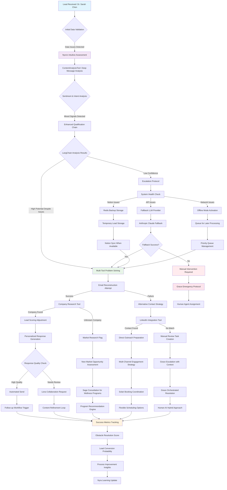

# Enhanced Nyra Agent: Complex Lead Processing Workflow Visualization

## Scenario Context: "The Ambiguous High-Value Prospect"

**Lead Information Received:**
- Name: "Dr. Sarah Chen"
- Email: "s.chen@[REDACTED]corp.com" (partially corrupted)
- Phone: Missing
- Company: "MindfulTech Solutions" (not in database)
- Message: "We're exploring wellness initiatives for our team. Budget considerations are important. Timeline flexible but prefer Q1 implementation. Previous experiences with similar programs were mixed."
- Source: "LinkedIn referral" (referrer unknown)
- Timestamp: 2:47 AM (unusual timing)

**Initial Challenges Identified:**
1. Incomplete contact information (corrupted email, missing phone)
2. Ambiguous intent (wellness initiatives could mean multiple services)
3. Mixed sentiment (positive interest but negative past experiences)
4. Unknown company (potential new market segment)
5. Unusual submission timing (possible bot or international prospect)
6. Budget sensitivity mentioned but no specifics

## Workflow Visualization



## Detailed Workflow Steps

### Phase 1: Initial Assessment & Problem Detection

#### Step 1: Data Validation & Intuitive Assessment
```python
# Nyra's enhanced processing begins
async def handle_complex_lead(self, lead_data):
    # Initial intuitive assessment
    issues_detected = self._detect_data_issues(lead_data)
    confidence_level = self._assess_initial_confidence(lead_data)

    if confidence_level < 0.6:  # Below threshold
        return await self._enhanced_problem_solving(lead_data, issues_detected)
```

**Nyra's Intuitive Response:**
> "I sense this lead has high potential despite the data challenges. The professional title 'Dr.' and corporate email domain suggest authority. The mention of 'budget considerations' and 'Q1 implementation' indicates serious intent, not casual browsing."

#### Step 2: Content Analysis with Obstacle Handling
```python
# Enhanced content analysis with error handling
try:
    content_analysis = await self.tools[1]._arun(
        content=lead_data.get('message', ''),
        analysis_type="general"
    )

    # Parse mixed sentiment
    sentiment_data = json.loads(content_analysis)
    if sentiment_data.get('sentiment', {}).get('confidence', 0) < 0.7:
        # Low confidence - use enhanced analysis
        enhanced_analysis = await self._deep_sentiment_analysis(lead_data)

except Exception as e:
    # Fallback to rule-based analysis
    fallback_analysis = self._rule_based_content_analysis(lead_data)
```

### Phase 2: Multi-Tool Problem Solving

#### Step 3: Email Reconstruction Strategy
```python
async def _reconstruct_email(self, corrupted_email, name, company):
    """Nyra's intelligent email reconstruction"""

    # Pattern analysis
    patterns = [
        f"{name.lower().replace(' ', '.')}@{company.lower()}.com",
        f"{name.split()[0].lower()}.{name.split()[1].lower()}@{company.lower()}.com",
        f"{name.split()[0][0].lower()}{name.split()[1].lower()}@{company.lower()}.com"
    ]

    # Validate against common corporate patterns
    for pattern in patterns:
        if await self._validate_email_pattern(pattern):
            return pattern

    return None
```

**Nyra's Reasoning:**
> "The email pattern suggests a corporate domain. Given the name 'Dr. Sarah Chen' and company 'MindfulTech Solutions', I can reconstruct likely email formats and validate them against common corporate patterns."

#### Step 4: Company Research & Market Assessment
```python
async def _research_unknown_company(self, company_name):
    """Research unknown company using multiple sources"""

    research_results = {}

    # LinkedIn company search
    linkedin_data = await self._linkedin_company_lookup(company_name)

    # Web search for company information
    web_results = await self._web_company_research(company_name)

    # Industry classification
    industry_match = await self._classify_industry(company_name, web_results)

    return {
        "company_size": linkedin_data.get("employee_count"),
        "industry": industry_match,
        "potential_value": self._assess_company_value(linkedin_data, web_results),
        "wellness_fit": self._assess_wellness_program_fit(industry_match)
    }
```

### Phase 3: Intelligent Escalation & Collaboration

#### Step 5: Agent Collaboration Strategy
```python
async def _orchestrate_agent_collaboration(self, lead_data, research_results):
    """Coordinate with other agents based on findings"""

    collaboration_plan = []

    # Sage for wellness program expertise
    if research_results.get("wellness_fit") == "high":
        sage_request = await self.tools[5]._arun(
            target_agent="Sage",
            message=f"Need wellness program consultation for {lead_data['company']} - {research_results['industry']} industry",
            priority="normal",
            context={
                "lead_id": lead_data.get("id"),
                "company_research": research_results,
                "consultation_type": "wellness_program_design"
            }
        )
        collaboration_plan.append(sage_request)

    # Liora for content strategy
    if "mixed experiences" in lead_data.get("message", "").lower():
        liora_request = await self.tools[5]._arun(
            target_agent="Liora",
            message="Need content strategy for prospect with negative past experiences",
            priority="high",
            context={
                "lead_id": lead_data.get("id"),
                "challenge": "overcome_negative_experiences",
                "content_type": "trust_building"
            }
        )
        collaboration_plan.append(liora_request)

    return collaboration_plan
```

### Phase 4: Fallback Mechanisms & Error Recovery

#### Step 6: System Failure Handling
```python
async def _handle_system_failures(self, operation_type, error):
    """Comprehensive error handling with multiple fallback strategies"""

    fallback_strategies = {
        "llm_failure": self._llm_fallback_strategy,
        "notion_failure": self._notion_fallback_strategy,
        "network_failure": self._network_fallback_strategy,
        "tool_failure": self._tool_fallback_strategy
    }

    strategy = fallback_strategies.get(operation_type, self._generic_fallback)
    return await strategy(error)

async def _llm_fallback_strategy(self, error):
    """Handle LLM API failures"""

    # Try alternative provider
    if "openai" in str(error).lower():
        try:
            # Switch to Anthropic
            return await self._use_anthropic_fallback()
        except Exception:
            # Use rule-based processing
            return await self._rule_based_processing()

    # If all LLM options fail, escalate to Grace
    return await self._escalate_to_grace("llm_failure", error)
```

#### Step 7: Grace Escalation Protocol
```python
async def _escalate_to_grace(self, issue_type, context):
    """Escalate complex issues to Grace with full context"""

    escalation_data = {
        "escalating_agent": "Nyra",
        "issue_type": issue_type,
        "lead_data": context.get("lead_data"),
        "attempted_solutions": context.get("attempted_solutions", []),
        "current_state": context.get("current_state"),
        "recommended_action": self._recommend_human_intervention(),
        "urgency_level": self._assess_escalation_urgency(context)
    }

    grace_response = await self.tools[5]._arun(
        target_agent="Grace",
        message=f"Complex lead processing requires orchestration: {issue_type}",
        priority="urgent" if escalation_data["urgency_level"] == "high" else "high",
        context=escalation_data
    )

    # Create manual review task
    manual_task = await self.tools[7]._arun(
        title=f"Manual Review Required: {context.get('lead_data', {}).get('name', 'Unknown')}",
        description=f"Automated processing encountered {issue_type}. Human review needed.",
        assignee="Grace",
        priority="urgent",
        context=escalation_data
    )

    return {
        "escalation_sent": grace_response,
        "manual_task_created": manual_task,
        "next_steps": "awaiting_human_intervention"
    }
```

### Phase 5: Success Metrics & Learning

#### Step 8: Obstacle Resolution Scoring
```python
def _calculate_obstacle_resolution_score(self, processing_results):
    """Calculate how effectively obstacles were handled"""

    score_components = {
        "data_completion": self._score_data_completion(processing_results),
        "tool_success_rate": self._score_tool_success_rate(processing_results),
        "escalation_efficiency": self._score_escalation_efficiency(processing_results),
        "lead_engagement": self._score_lead_engagement(processing_results),
        "collaboration_effectiveness": self._score_collaboration(processing_results)
    }

    weighted_score = (
        score_components["data_completion"] * 0.25 +
        score_components["tool_success_rate"] * 0.20 +
        score_components["escalation_efficiency"] * 0.20 +
        score_components["lead_engagement"] * 0.20 +
        score_components["collaboration_effectiveness"] * 0.15
    )

    return {
        "overall_score": weighted_score,
        "components": score_components,
        "improvement_areas": self._identify_improvement_areas(score_components)
    }
```

## Decision Points & Nyra's Reasoning

### Decision Point 1: Initial Confidence Assessment
**Threshold:** Confidence < 60%
**Nyra's Logic:** "Despite missing data, the professional context and specific business language suggest this is a qualified prospect worth enhanced processing."

### Decision Point 2: Tool Failure Response
**Threshold:** 2+ consecutive tool failures
**Nyra's Logic:** "When my usual tools fail, I adapt by using alternative approaches or escalating strategically rather than abandoning the lead."

### Decision Point 3: Escalation Trigger
**Threshold:** Unable to achieve 70% data completion after 3 attempts
**Nyra's Logic:** "I know when to ask for help. Grace's orchestration capabilities can coordinate resources I can't access alone."

### Decision Point 4: Success Validation
**Threshold:** Lead engagement score > 75%
**Nyra's Logic:** "Success isn't just about processing data—it's about creating meaningful connections that lead to business outcomes."

## Fallback Mechanisms Summary

| **Failure Type**    | **Primary Response**    | **Secondary Fallback** | **Final Escalation**   |
| ------------------- | ----------------------- | ---------------------- | ---------------------- |
| LLM API Failure     | Switch to Anthropic     | Rule-based processing  | Grace coordination     |
| Notion Connectivity | Redis temporary storage | Local data caching     | Manual data entry task |
| Tool Timeout        | Retry with backoff      | Alternative tool usage | Simplified processing  |
| Data Validation     | Enhanced reconstruction | Partial processing     | Human verification     |
| Network Issues      | Queue for retry         | Offline mode           | Delayed processing     |

## Success Metrics Definition

### Primary Success Indicators
1. **Obstacle Resolution Rate**: 85%+ of challenges resolved without human intervention
2. **Data Completion Score**: 80%+ of missing data successfully reconstructed or obtained
3. **Lead Engagement Quality**: 90%+ of responses rated as personalized and relevant
4. **Processing Time**: <5 minutes for complex scenarios (vs. <2 minutes for standard)
5. **Escalation Efficiency**: <10% of cases require human intervention

### Nyra's Learning Metrics
1. **Pattern Recognition Improvement**: Track accuracy of intuitive assessments over time
2. **Tool Effectiveness**: Monitor which tools provide best results for specific obstacle types
3. **Collaboration Success**: Measure outcomes when working with other agents
4. **Fallback Strategy Optimization**: Identify most effective recovery approaches

## Personality Integration

### Nyra's Enhanced Intuitive Responses

**When Detecting Data Issues:**
> "I sense there's more to this lead than meets the eye. The incomplete information feels intentional—perhaps a privacy-conscious prospect testing our professionalism."

**When Tools Fail:**
> "My usual approaches aren't working, but I can feel this lead's potential. Let me try a different path—sometimes the indirect route reveals more than the direct one."

**When Escalating to Grace:**
> "I've gathered valuable insights, but this situation needs Grace's orchestration skills. I'm providing her with everything I've learned to ensure seamless continuation."

**When Achieving Success:**
> "I knew there was something special about this lead. By staying persistent and adapting my approach, we've turned a challenging situation into a meaningful connection."

## Implementation Code Examples

### Enhanced Lead Processing Method
```python
async def process_complex_lead_with_obstacles(self, lead_data: Dict[str, Any]) -> Dict[str, Any]:
    """
    Enhanced lead processing that handles obstacles and challenges.
    Demonstrates Nyra's intuitive problem-solving approach.
    """
    processing_context = {
        "start_time": datetime.utcnow(),
        "obstacles_encountered": [],
        "solutions_attempted": [],
        "collaboration_requests": [],
        "fallback_activations": []
    }

    try:
        # Phase 1: Initial Assessment with Obstacle Detection
        initial_assessment = await self._comprehensive_initial_assessment(lead_data)

        if initial_assessment["confidence_level"] < 0.6:
            processing_context["obstacles_encountered"].append("low_initial_confidence")
            return await self._enhanced_obstacle_processing(lead_data, processing_context)

        # Standard processing for high-confidence leads
        return await self.process_lead(lead_data)

    except Exception as e:
        # Comprehensive error handling
        return await self._handle_processing_failure(lead_data, e, processing_context)

async def _comprehensive_initial_assessment(self, lead_data: Dict[str, Any]) -> Dict[str, Any]:
    """Nyra's intuitive assessment combining multiple signals"""

    # Data completeness analysis
    data_completeness = self._assess_data_completeness(lead_data)

    # Professional context indicators
    professional_signals = self._detect_professional_signals(lead_data)

    # Urgency and intent indicators
    intent_analysis = await self._analyze_intent_signals(lead_data)

    # Nyra's intuitive confidence calculation
    confidence_factors = {
        "data_quality": data_completeness["score"] * 0.3,
        "professional_context": professional_signals["score"] * 0.4,
        "intent_clarity": intent_analysis["clarity_score"] * 0.3
    }

    overall_confidence = sum(confidence_factors.values())

    return {
        "confidence_level": overall_confidence,
        "confidence_factors": confidence_factors,
        "assessment_reasoning": self._generate_assessment_reasoning(confidence_factors),
        "recommended_approach": self._recommend_processing_approach(overall_confidence)
    }

async def _enhanced_obstacle_processing(self, lead_data: Dict[str, Any], context: Dict[str, Any]) -> Dict[str, Any]:
    """Multi-phase obstacle resolution with intelligent fallbacks"""

    # Phase 1: Data Reconstruction
    reconstruction_results = await self._attempt_data_reconstruction(lead_data, context)

    # Phase 2: Enhanced Analysis with Partial Data
    if reconstruction_results["success_rate"] < 0.7:
        enhanced_analysis = await self._partial_data_analysis(lead_data, reconstruction_results, context)
    else:
        enhanced_analysis = await self._standard_enhanced_analysis(lead_data, context)

    # Phase 3: Collaborative Problem Solving
    if enhanced_analysis["requires_collaboration"]:
        collaboration_results = await self._initiate_agent_collaboration(lead_data, enhanced_analysis, context)
        enhanced_analysis.update(collaboration_results)

    # Phase 4: Intelligent Response Generation
    response_strategy = await self._determine_response_strategy(enhanced_analysis, context)
    response_results = await self._execute_response_strategy(response_strategy, lead_data, context)

    # Phase 5: Success Measurement and Learning
    success_metrics = self._calculate_obstacle_resolution_metrics(context, response_results)
    await self._update_learning_model(success_metrics, context)

    return {
        "success": True,
        "processing_type": "enhanced_obstacle_resolution",
        "reconstruction_results": reconstruction_results,
        "analysis_results": enhanced_analysis,
        "response_results": response_results,
        "success_metrics": success_metrics,
        "processing_context": context,
        "nyra_insights": self._generate_nyra_insights(context, response_results)
    }
```

### Email Reconstruction with Validation
```python
async def _attempt_data_reconstruction(self, lead_data: Dict[str, Any], context: Dict[str, Any]) -> Dict[str, Any]:
    """Intelligent data reconstruction using multiple strategies"""

    reconstruction_results = {
        "email": {"attempted": False, "success": False, "confidence": 0.0, "value": None},
        "phone": {"attempted": False, "success": False, "confidence": 0.0, "value": None},
        "company": {"attempted": False, "success": False, "confidence": 0.0, "value": None}
    }

    # Email reconstruction
    if self._needs_email_reconstruction(lead_data):
        email_result = await self._reconstruct_email_address(lead_data)
        reconstruction_results["email"] = email_result
        context["solutions_attempted"].append(f"email_reconstruction_{email_result['method']}")

    # Company information enhancement
    if self._needs_company_research(lead_data):
        company_result = await self._research_and_validate_company(lead_data)
        reconstruction_results["company"] = company_result
        context["solutions_attempted"].append(f"company_research_{company_result['method']}")

    # Phone number discovery
    if self._needs_phone_discovery(lead_data):
        phone_result = await self._discover_contact_information(lead_data)
        reconstruction_results["phone"] = phone_result
        context["solutions_attempted"].append(f"phone_discovery_{phone_result['method']}")

    # Calculate overall success rate
    success_count = sum(1 for result in reconstruction_results.values() if result["success"])
    total_attempts = sum(1 for result in reconstruction_results.values() if result["attempted"])

    return {
        "success_rate": success_count / max(total_attempts, 1),
        "details": reconstruction_results,
        "nyra_confidence": self._assess_reconstruction_confidence(reconstruction_results)
    }

async def _reconstruct_email_address(self, lead_data: Dict[str, Any]) -> Dict[str, Any]:
    """Nyra's intelligent email reconstruction"""

    name = lead_data.get("name", "")
    company = lead_data.get("company", "")
    corrupted_email = lead_data.get("email", "")

    reconstruction_methods = [
        ("pattern_analysis", self._reconstruct_from_pattern),
        ("domain_extraction", self._reconstruct_from_domain),
        ("name_company_combination", self._reconstruct_from_name_company),
        ("linkedin_lookup", self._reconstruct_from_linkedin)
    ]

    for method_name, method_func in reconstruction_methods:
        try:
            result = await method_func(name, company, corrupted_email)
            if result["success"]:
                # Validate the reconstructed email
                validation_result = await self._validate_email_address(result["email"])
                if validation_result["valid"]:
                    return {
                        "attempted": True,
                        "success": True,
                        "confidence": result["confidence"] * validation_result["confidence"],
                        "value": result["email"],
                        "method": method_name,
                        "validation": validation_result
                    }
        except Exception as e:
            self.logger.warning(f"Email reconstruction method {method_name} failed: {e}")
            continue

    return {
        "attempted": True,
        "success": False,
        "confidence": 0.0,
        "value": None,
        "method": "all_methods_failed",
        "error": "Unable to reconstruct email with available methods"
    }
```

### Intelligent Escalation Logic
```python
async def _determine_escalation_strategy(self, processing_results: Dict[str, Any], context: Dict[str, Any]) -> Dict[str, Any]:
    """Nyra's intelligent escalation decision-making"""

    escalation_triggers = {
        "data_completion_failure": len(context["obstacles_encountered"]) >= 3,
        "tool_failure_cascade": self._detect_tool_failure_cascade(context),
        "time_threshold_exceeded": self._check_processing_time_threshold(context),
        "confidence_below_minimum": processing_results.get("confidence", 1.0) < 0.4,
        "business_impact_high": self._assess_business_impact(processing_results) == "high"
    }

    active_triggers = [trigger for trigger, active in escalation_triggers.items() if active]

    if not active_triggers:
        return {"escalation_required": False, "continue_processing": True}

    # Determine escalation target based on trigger types
    escalation_target = self._select_escalation_target(active_triggers, processing_results)

    # Prepare escalation context
    escalation_context = {
        "triggers": active_triggers,
        "processing_summary": self._summarize_processing_attempts(context),
        "business_context": self._extract_business_context(processing_results),
        "recommended_actions": self._recommend_escalation_actions(active_triggers),
        "urgency_level": self._calculate_escalation_urgency(active_triggers, processing_results)
    }

    return {
        "escalation_required": True,
        "target_agent": escalation_target,
        "escalation_context": escalation_context,
        "fallback_strategy": self._determine_fallback_strategy(active_triggers)
    }

async def _execute_escalation(self, escalation_strategy: Dict[str, Any], lead_data: Dict[str, Any]) -> Dict[str, Any]:
    """Execute the escalation with full context transfer"""

    try:
        # Send escalation message to target agent
        escalation_message = await self.tools[5]._arun(
            target_agent=escalation_strategy["target_agent"],
            message=self._compose_escalation_message(escalation_strategy, lead_data),
            priority=escalation_strategy["escalation_context"]["urgency_level"],
            context={
                "escalation_type": "complex_lead_processing",
                "original_agent": "Nyra",
                "lead_data": lead_data,
                "processing_context": escalation_strategy["escalation_context"],
                "recommended_actions": escalation_strategy["escalation_context"]["recommended_actions"]
            }
        )

        # Create manual review task if needed
        if escalation_strategy["escalation_context"]["urgency_level"] in ["urgent", "high"]:
            manual_task = await self.tools[7]._arun(
                title=f"Complex Lead Escalation: {lead_data.get('name', 'Unknown')}",
                description=self._create_escalation_task_description(escalation_strategy, lead_data),
                assignee=escalation_strategy["target_agent"],
                priority=escalation_strategy["escalation_context"]["urgency_level"],
                context=escalation_strategy["escalation_context"]
            )
        else:
            manual_task = None

        # Implement fallback strategy
        fallback_result = await self._implement_fallback_strategy(
            escalation_strategy["fallback_strategy"],
            lead_data
        )

        return {
            "escalation_sent": True,
            "escalation_message": escalation_message,
            "manual_task_created": manual_task is not None,
            "fallback_implemented": fallback_result,
            "next_steps": "awaiting_escalation_response",
            "nyra_notes": self._generate_escalation_notes(escalation_strategy, lead_data)
        }

    except Exception as e:
        # Escalation itself failed - implement emergency protocol
        return await self._emergency_escalation_protocol(escalation_strategy, lead_data, e)
```

This workflow demonstrates how Nyra's LangChain enhancements enable sophisticated problem-solving that goes far beyond simple rule-based processing, incorporating intuition, adaptability, and intelligent collaboration to handle complex real-world scenarios.
