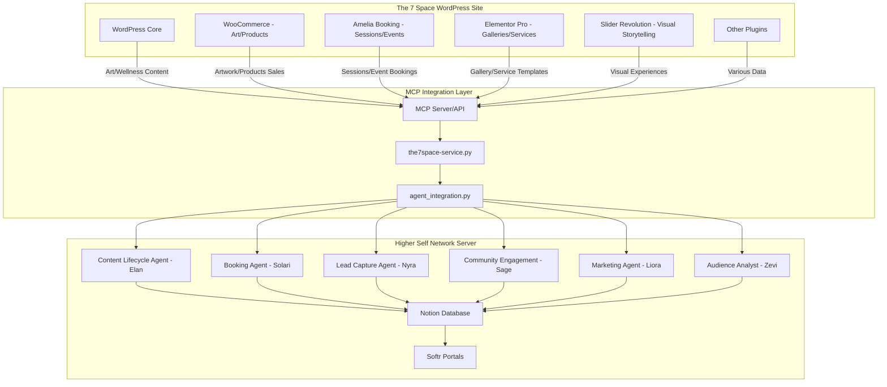
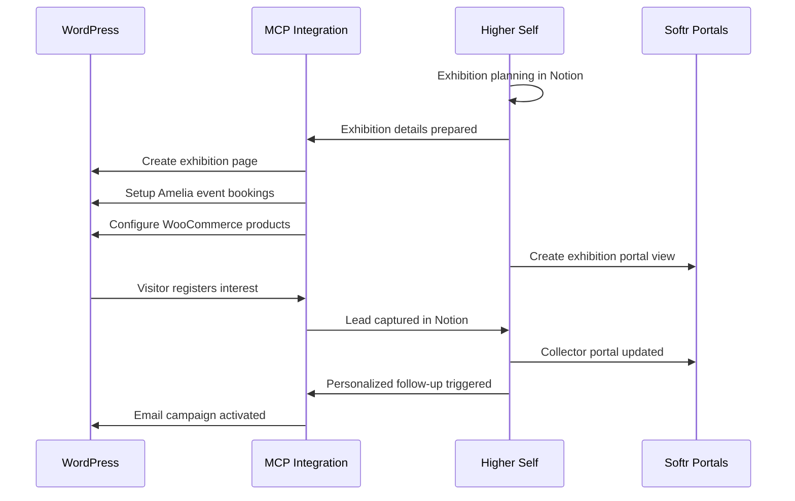
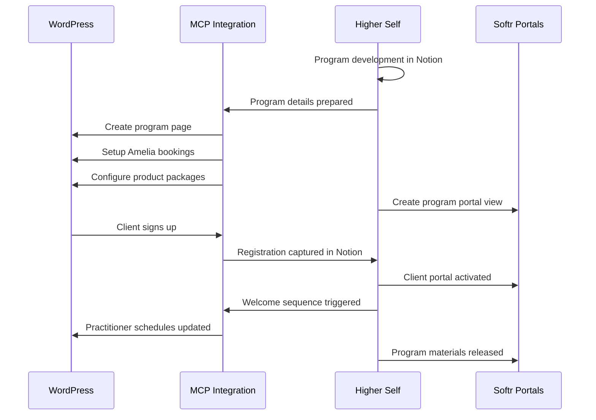
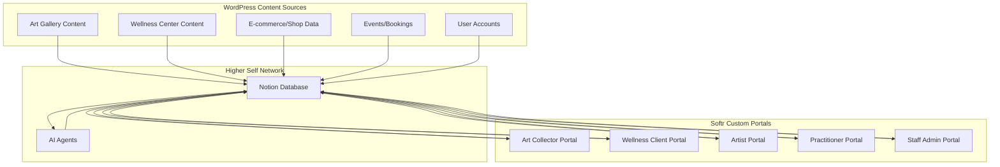
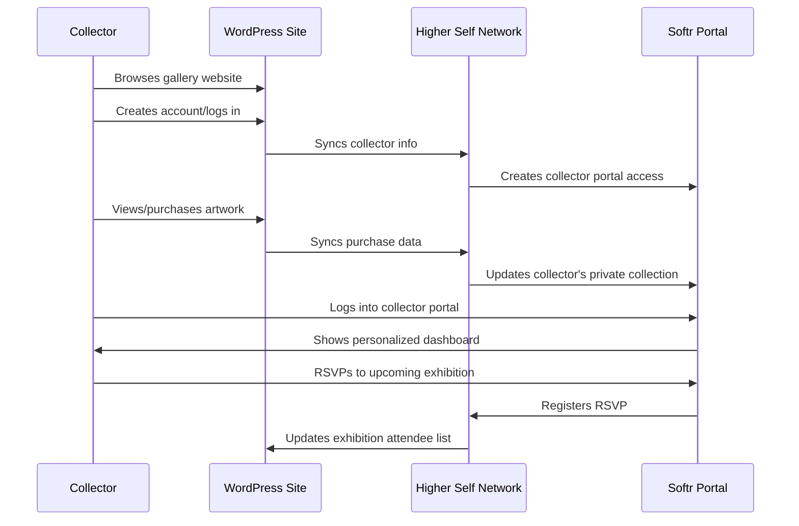
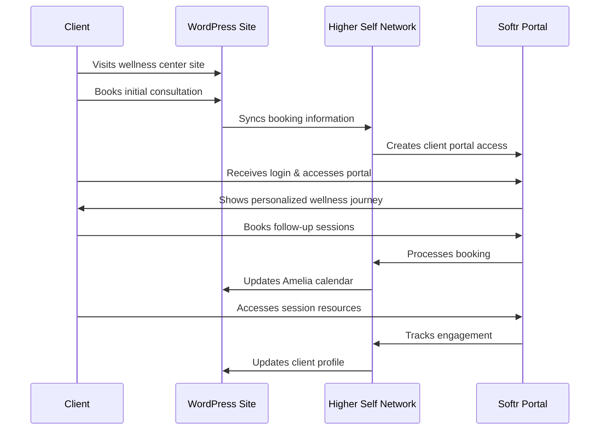
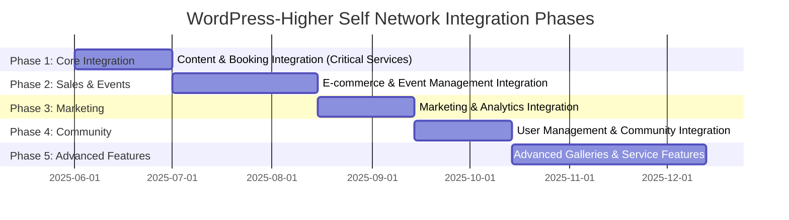
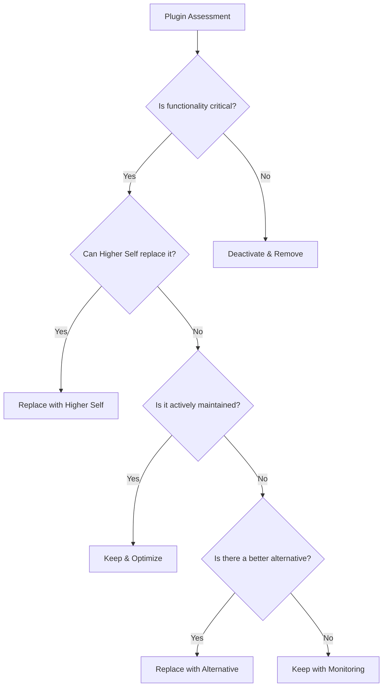

# WordPress-Higher Self Network Integration Strategy

## For The 7 Space Art Gallery & Wellness Center

## Executive Summary

This integration strategy document outlines the comprehensive approach to connecting The 7 Space's WordPress-based website with The Higher Self Network server. By leveraging the Model Context Protocol (MCP) integration, this solution bridges WordPress plugins with Higher Self Network's intelligent agent system to create a seamless experience across both platforms.

The 7 Space, as both an art gallery and wellness center, requires a specialized integration that supports its dual business nature. This document provides a detailed roadmap for:

1. Aligning WordPress plugin functionality with Higher Self Network capabilities
2. Supporting art gallery-specific operations (exhibitions, artist management, artwork sales)
3. Enabling wellness center services (practitioner scheduling, treatment bookings, wellness programs)
4. Creating targeted client/community portals for different user types
5. Optimizing the current plugin architecture (14 active, 111 inactive plugins)

This integration will deliver substantial benefits including:

- Centralized data management in Notion
- Automated workflow orchestration through intelligent agents
- Personalized client experiences via customized Softr portals
- Reduced technical complexity and maintenance overhead
- Enhanced marketing and business intelligence capabilities

The implementation will follow a phased approach prioritized by business impact, with initial focus on core content synchronization and booking capabilities, followed by e-commerce integration, and culminating in advanced portal experiences for clients and staff.

## Functional Integration Matrix

The following matrix cross-matches WordPress functional categories with Higher Self Network capabilities, highlighting specific benefits for The 7 Space's art gallery and wellness center operations:

### Content Management

| WordPress Function | Higher Self Capability | Art Gallery Application | Wellness Center Application |
|-------------------|------------------------|-------------------------|----------------------------|
| Page/Post Creation | Content Lifecycle Agent (Elan) | Exhibition landing pages, artist profiles | Treatment descriptions, practitioner bios |
| Media Management | Content Lifecycle Agent (Elan) | Artwork images, gallery virtual tours | Wellness space imagery, treatment videos |
| Taxonomies & Categories | Content Lifecycle Agent (Elan) | Art styles, mediums, collections | Treatment types, modalities, programs |
| Custom Post Types | Content Lifecycle Agent (Elan) | Artist portfolios, exhibitions | Practitioner specialties, wellness programs |

### E-commerce

| WordPress Function | Higher Self Capability | Art Gallery Application | Wellness Center Application |
|-------------------|------------------------|-------------------------|----------------------------|
| Product Catalog | E-commerce Integration | Artwork inventory, limited editions | Wellness products, program materials |
| Shopping Cart & Checkout | E-commerce Integration | Artwork purchases, exhibition tickets | Treatment packages, class passes |
| Inventory Management | Task Management (Ruvo) | Artwork availability tracking | Product stock, class space management |
| Payment Processing | E-commerce Integration | Artist commissions, split payments | Practitioner payouts, membership billing |

### Booking/Scheduling

| WordPress Function | Higher Self Capability | Art Gallery Application | Wellness Center Application |
|-------------------|------------------------|-------------------------|----------------------------|
| Appointment Booking | Booking Agent (Solari) | Private viewings, artist consultations | Treatment sessions, consultations |
| Event Management | Booking Agent (Solari) | Exhibition openings, artist talks | Workshops, classes, retreats |
| Resource Allocation | Booking Agent (Solari) | Gallery space usage, equipment | Treatment rooms, equipment |
| Calendar Sync | Booking Agent (Solari) | Artist availability, gallery hours | Practitioner schedules, center hours |

### User Management

| WordPress Function | Higher Self Capability | Art Gallery Application | Wellness Center Application |
|-------------------|------------------------|-------------------------|----------------------------|
| User Profiles | Lead Capture Agent (Nyra) | Collector profiles, preferences | Client health history, preferences |
| Membership Management | Community Engagement (Sage) | VIP collector programs, benefits | Wellness memberships, class passes |
| User Segmentation | Audience Segmentation (Zevi) | Collector interests, buying patterns | Treatment preferences, wellness goals |
| Authentication | API Integration | Artist portal access, collector area | Practitioner portal, client resources |

### Marketing/Analytics

| WordPress Function | Higher Self Capability | Art Gallery Application | Wellness Center Application |
|-------------------|------------------------|-------------------------|----------------------------|
| Email Marketing | Marketing Strategy (Liora) | Exhibition announcements, artist news | Class promotions, wellness tips |
| Social Media Integration | Marketing Strategy (Liora) | Gallery events, artwork spotlights | Wellness challenges, practitioner features |
| Analytics Tracking | Audience Segmentation (Zevi) | Artwork interest, visitor patterns | Service popularity, client retention |
| SEO Optimization | Content Lifecycle (Elan) | Exhibition SEO, artist keywords | Treatment SEO, wellness terms |

### Site Building/Optimization

| WordPress Function | Higher Self Capability | Art Gallery Application | Wellness Center Application |
|-------------------|------------------------|-------------------------|----------------------------|
| Page Building | Content Lifecycle (Elan) | Exhibition layouts, art displays | Service pages, practitioner showcases |
| Performance Optimization | Technical Integration | Image optimization for artwork | Video optimization for classes |
| Mobile Responsiveness | Technical Integration | Mobile gallery browsing | On-the-go class booking |
| CDN Integration | Technical Integration | High-resolution artwork delivery | Smooth video streaming for classes |

## Wellness Offering Integrations

The wellness offerings represent a core aspect of The 7 Space's business. This section details the specific integrations needed to support the full spectrum of wellness services:

### Wellness Program Management

| WordPress Component | Higher Self Integration | Key Functionality |
|---------------------|-------------------------|------------------|
| Program Custom Post Type | Content Lifecycle Agent | Creation, updating, and publishing of structured wellness program content |
| Program Registration Forms | Lead Capture Agent | Capturing participant information and preferences |
| Program Scheduling | Booking Agent | Managing session dates, times, and practitioner assignments |
| Program Materials | Content Lifecycle Agent | Delivery of digital materials to participants |
| Progress Tracking | Custom Portal Integration | Tracking participant progress through program milestones |

### Treatment Modality Catalog

| WordPress Component | Higher Self Integration | Key Functionality |
|---------------------|-------------------------|------------------|
| Modality Taxonomy | Content Lifecycle Agent | Organizing treatments by approach and technique |
| Practitioner-Modality Relations | Content Lifecycle Agent | Mapping which practitioners offer which modalities |
| Modality Content | Knowledge Retrieval (Atlas) | Educational content about each wellness modality |
| Modality Effectiveness | Community Engagement | Client testimonials and results by modality |
| Cross-modality Programs | Content Lifecycle Agent | Creating integrated wellness programs combining modalities |

### Wellness Journey Mapping

| WordPress Component | Higher Self Integration | Key Functionality |
|---------------------|-------------------------|------------------|
| Client Journey Templates | Workflow Instances | Pre-defined wellness journeys for common goals |
| Assessment Forms | Lead Capture Agent | Client intake and goal assessment |
| Recommendation Engine | AI Provider Service | Suggesting appropriate modalities and practitioners |
| Progress Documentation | Booking Agent | Tracking sessions and outcomes |
| Journey Visualization | Softr Client Portal | Visual representation of client's wellness journey |

### Virtual Wellness Services

| WordPress Component | Higher Self Integration | Key Functionality |
|---------------------|-------------------------|------------------|
| Video Integration | Video Content Agent | Hosting and delivery of virtual wellness sessions |
| Live Streaming | Technical Integration | Live classes and workshops |
| On-demand Library | Content Lifecycle Agent | Catalog of recorded sessions and classes |
| Interactive Elements | Softr Portal Integration | Guided practices, journaling, reflection tools |
| Community Features | Community Engagement | Shared experiences and group support |

### Practitioner Collaboration Tools

| WordPress Component | Higher Self Integration | Key Functionality |
|---------------------|-------------------------|------------------|
| Practitioner Dashboard | Softr Practitioner Portal | Schedule, client information, session notes |
| Cross-referral System | Task Management Agent | Referring clients between practitioners |
| Collaborative Care | Notion Integration | Shared client notes and treatment plans |
| Resource Library | Content Lifecycle Agent | Shared resources for client support |
| Professional Development | Content Lifecycle Agent | Training materials and continuing education |

## Integration Architecture

The integration between The 7 Space WordPress site and the Higher Self Network follows this architectural approach:

### Data Flow Details

The integration leverages these key data flows:

1. **Content Synchronization**
   - WordPress content (posts, pages, CPTs) → MCP → Content Lifecycle Agent → Notion
   - Notion content updates → Content Lifecycle Agent → MCP → WordPress

2. **Booking System Integration**
   - Amelia bookings → MCP → Booking Agent → Notion
   - Booking Agent schedule updates → MCP → Amelia

3. **E-commerce Integration**
   - WooCommerce products/orders → MCP → Various Agents → Notion
   - Inventory/pricing updates → MCP → WooCommerce

4. **User Management**
   - WordPress user registration → MCP → Lead Capture Agent → Notion
   - User segment updates → Audience Agent → MCP → WordPress

5. **Visual Content Management**
   - Elementor/Slider Revolution templates → MCP → Content Agent → Notion
   - Visual content strategy → Content Agent → MCP → WordPress

### Business Process Flows

Key business processes are mapped across the integration:

#### Art Exhibition Launch Process

#### Wellness Program Launch Process

## Softr Portals Integration: Client & Customer Experience

The Softr portals provide customized experiences for different user types, creating a seamless connection between The 7 Space's WordPress site and the Higher Self Network's backend capabilities.

### Portal Types and Business-Specific Experiences

1. **Art Collector Portal**
   - **Purpose:** Personalized space for art collectors to view purchases, upcoming exhibitions, and exclusive content
   - **Key Features:**
     - Private collection management
     - Early access to new artworks
     - Exhibition RSVP and digital catalogs
     - Artist meet-and-greet bookings
     - Collector community access
   - **WordPress Integration:** Pulls artwork catalog, exhibition data, artist information
   - **Higher Self Integration:** Uses Elan (Content Agent) and Solari (Booking Agent) for personalized experiences

2. **Wellness Client Portal**
   - **Purpose:** Client-centered portal for wellness journey management
   - **Key Features:**
     - Session booking and history
     - Personalized wellness plans
     - Practitioner recommendations
     - Resource library and progress tracking
     - Community workshops access
   - **WordPress Integration:** Pulls session types, practitioner profiles, wellness content
   - **Higher Self Integration:** Uses Solari (Booking Agent) and Sage (Community Agent) for personalized client journey

3. **Artist Portal**
   - **Purpose:** Workspace for represented artists to manage their gallery presence
   - **Key Features:**
     - Artwork inventory management
     - Exhibition participation
     - Sales tracking and reporting
     - Gallery communication tools
     - Promotional material submission
   - **WordPress Integration:** Pushes/pulls artist profile data, artwork details
   - **Higher Self Integration:** Uses Elan (Content Agent) and Liora (Marketing Agent)

4. **Practitioner Portal**
   - **Purpose:** Management dashboard for wellness practitioners
   - **Key Features:**
     - Schedule management
     - Client session notes
     - Service offering management
     - Resource creation and sharing
     - Program development tools
   - **WordPress Integration:** Pushes/pulls practitioner profiles, service details
   - **Higher Self Integration:** Uses Solari (Booking Agent) and Elan (Content Agent)

5. **Staff Admin Portal**
   - **Purpose:** Unified management dashboard for gallery and wellness center staff
   - **Key Features:**
     - Cross-business reporting
     - Inventory and booking management
     - Content calendar and approval workflows
     - Customer/client management
     - Marketing campaign orchestration
   - **WordPress Integration:** Full bidirectional sync with WordPress systems
   - **Higher Self Integration:** Connects with all agent systems

### User Journey Examples

#### Art Collector Journey Example

#### Wellness Client Journey Example

### Portal Implementation Strategy

1. **Data Source Mapping:**
   - WordPress content to Notion database mapping
   - Custom fields and relationships
   - Bidirectional sync requirements

2. **Authentication & Authorization:**
   - Single sign-on approach between WordPress and Softr
   - Role-based access control
   - Security considerations

3. **Phased Portal Deployment:**
   - Priority order based on business impact
   - Feature rollout schedule
   - Testing and feedback loops

4. **Portal Customization:**
   - Branding and design consistency
   - User experience optimization
   - Mobile responsiveness

5. **Integration Points:**
   - WordPress hooks and actions
   - Higher Self Network agent interactions
   - External service connections

## Implementation Strategy

The implementation follows a phased approach prioritized by business impact:

### Phase 1: Core Integration (Month 1)

- Setup MCP server and core connections
- Implement basic WordPress content synchronization (posts, pages)
- Connect Amelia booking system with Booking Agent
- Establish baseline user account synchronization
- Create initial Notion database connections

**Key Deliverables:**

- Functional MCP integration with The 7 Space WordPress site
- Two-way content synchronization for key content types
- Basic appointment booking integration
- Foundation for user data integration

### Phase 2: Sales & Events (Months 2-3)

- Implement WooCommerce product/order integration
- Develop event management workflows
- Create artwork catalog synchronization
- Build wellness service offering connections
- Establish inventory management processes

**Key Deliverables:**

- Complete e-commerce integration
- Exhibition and event management system
- Artwork and product inventory synchronization
- Treatment and service package integration

### Phase 3: Marketing (Month 4)

- Implement marketing campaign integration
- Connect analytics systems
- Develop audience segmentation capabilities
- Build email marketing automation
- Create reporting dashboards

**Key Deliverables:**

- Marketing campaign management system
- Integrated analytics dashboard
- Automated marketing workflows
- Personalization capabilities

### Phase 4: Community (Month 5)

- Implement community features integration
- Develop user profile enrichment
- Build membership management
- Create loyalty program integration
- Establish community engagement tracking

**Key Deliverables:**

- Complete user management integration
- Membership and loyalty program automation
- Community engagement tools
- Personalized user experiences

### Phase 5: Advanced Features (Months 6-7)

- Deploy Softr portal integrations
- Implement advanced visual features
- Develop specialized art gallery tools
- Create enhanced wellness journey mapping
- Build cross-business optimization features

**Key Deliverables:**

- Full suite of Softr portals for all user types
- Advanced visual galleries and wellness presentations
- Complete wellness journey tracking
- Holistic view of client interactions across businesses

## Plugin Optimization Strategy

With 125 plugins (14 active, 111 inactive), The 7 Space's WordPress site requires careful optimization to ensure performance and maintainability. The following strategy addresses plugin optimization aligned with business functions:

### Plugin Audit Process

The optimization follows this decision framework:

### Business Function Categorization

Plugins will be organized and evaluated based on these business functions:

1. **Art Gallery Core Functions**
   - Exhibition management
   - Artwork catalog/inventory
   - Artist profiles/management
   - Gallery visualization

2. **Wellness Center Core Functions**
   - Booking/scheduling
   - Practitioner management
   - Program/class management
   - Client management

3. **Shared Business Functions**
   - E-commerce/payments
   - Marketing/communications
   - User management
   - Content management

4. **Technical/Utility Functions**
   - Performance optimization
   - Security
   - SEO
   - Development tools

### Plugin Consolidation Recommendations

The strategy recommends:

1. **Core Plugin Set (10-15 plugins)**
   - WordPress core + key business function plugins
   - Critical WooCommerce extensions
   - Security and performance essentials

2. **Higher Self Network Replacements**
   - Content management extensions → Content Lifecycle Agent
   - User management plugins → Lead Capture Agent
   - Marketing automation plugins → Marketing Agent
   - Analytics plugins → Audience Analyst Agent

3. **Custom Development Opportunities**
   - Replace multiple single-purpose plugins with focused custom development
   - Create purpose-built extensions specifically for The 7 Space

4. **Plugin Retirement Plan**
   - Strategy for safely removing unnecessary plugins
   - Data migration approach where needed
   - Testing methodology to ensure no functionality loss

## Gap Analysis & Opportunities

The current integration approach reveals several gaps and opportunities:

### Integration Gaps

1. **Real-time Synchronization**
   - Current WordPress-Notion sync has potential latency
   - Critical for inventory and booking operations
   - **Solution:** Implement webhook-based immediate updates for time-sensitive data

2. **Complex Visual Layouts**
   - Elementor Pro layouts don't translate perfectly to Notion/Softr
   - Important for art gallery visual presentations
   - **Solution:** Create specialized visual translation layer for gallery experiences

3. **Advanced E-commerce Features**
   - Split payments for artist commissions
   - Complex bundling for wellness packages
   - **Solution:** Develop custom WooCommerce extensions that integrate with Higher Self

4. **Legacy Data Management**
   - Historical gallery/client data integration
   - **Solution:** Develop data migration tools and historical data viewer

### Enhancement Opportunities

1. **AI-Enhanced Art Recommendations**
   - Leverage RAG capabilities for personalized art recommendations
   - Connect visitor browsing patterns with collection suggestions
   - Enable virtual curator experiences

2. **Wellness Journey Intelligence**
   - Use Higher Self's agents to create intelligent wellness recommendations
   - Analyze treatment effectiveness and patterns
   - Enable predictive wellness planning

3. **Unified Client View**
   - Create a 360° view of clients across both gallery and wellness operations
   - Identify cross-business opportunities
   - Enable personalized cross-business marketing

4. **Advanced Visual Experiences**
   - Integrate AR/VR capabilities for virtual gallery experiences
   - Create immersive wellness visualizations
   - Build digital twin of physical gallery/wellness spaces

5. **Practitioner/Artist Collaboration**
   - Build tools for artist-practitioner collaborative projects
   - Enable wellness-inspired art and art-inspired wellness experiences
   - Create cross-discipline events and programs

## Art Gallery & Wellness Center Use Case Matrix

This matrix showcases specific integration use cases for each business type:

| Business Function | Art Gallery Use Case | Wellness Center Use Case | Integration Approach |
|-------------------|----------------------|--------------------------|----------------------|
| Content Management | Artist profile syncing from WP to Notion | Practitioner profiles syncing from WP to Notion | Content Lifecycle Agent |
| Artwork/Service Catalog | Artwork inventory in WooCommerce synced to Notion | Treatment offerings in Amelia synced to Notion | E-commerce & Booking Agents |
| Digital Asset Management | High-resolution artwork images with licensing | Treatment videos and wellness resources | Content Lifecycle Agent |
| Event/Session Booking | Exhibition openings in Amelia synced to Notion | Treatment sessions in Amelia synced to Notion | Booking Agent |
| Client Management | Collector information synced between WP and Notion | Client information and health history synced | Lead Capture Agent |
| Marketing Automation | Exhibition promotions to targeted collector segments | Wellness program promotions to client segments | Marketing Agent |
| Sales Processing | Artwork purchases with artist commissions | Package sales with practitioner allocations | E-commerce Integration |
| Community Building | Collector community engagement and exclusives | Wellness journey sharing and support groups | Community Agent |
| Analytics & Reporting | Exhibition performance and artwork interest | Treatment popularity and client wellness progress | Audience Analyst |
| Visual Presentation | Gallery and exhibition virtual tours | Wellness space and treatment showcases | Content Lifecycle Agent |

## Conclusion

This integration strategy creates a powerful bridge between The 7 Space's WordPress-based public presence and the Higher Self Network's intelligent backend operations. By leveraging the MCP integration, the architecture supports both art gallery and wellness center operations while enabling sophisticated client experiences through customized Softr portals.

The implementation approach balances immediate business needs with long-term strategic goals, creating a foundation that can evolve with The 7 Space's growth. The plugin optimization strategy significantly reduces technical debt while enhancing capabilities.

By following this strategy, The 7 Space will achieve:

1. **Unified Business Operations** across gallery and wellness functions
2. **Enhanced Client Experiences** through personalized portals
3. **Automated Workflows** reducing manual administration
4. **Business Intelligence** driving better decisions
5. **Technical Stability** through simplified infrastructure

The result will be a seamless ecosystem where technology enhances rather than complicates the unique artistic and wellness experiences that make The 7 Space special.
